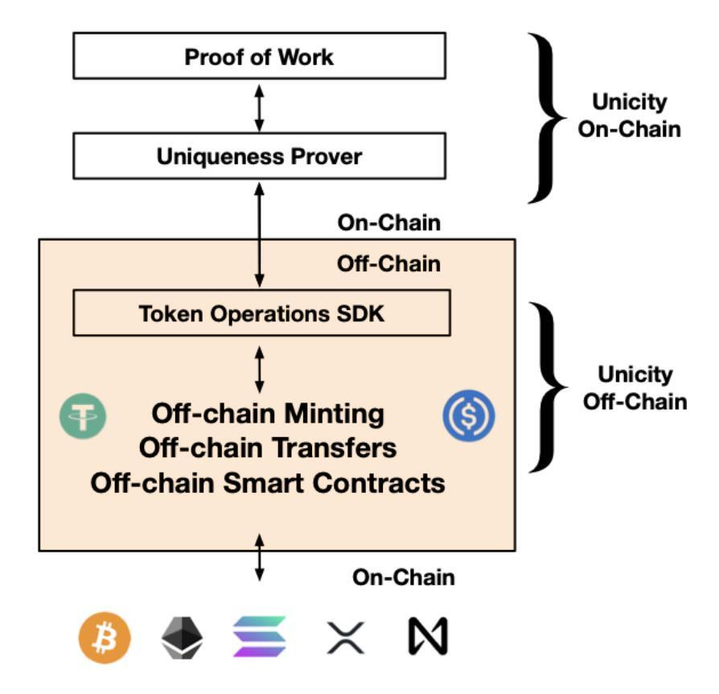
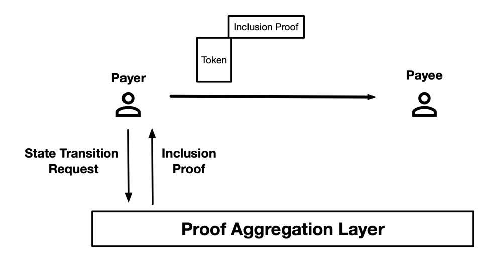
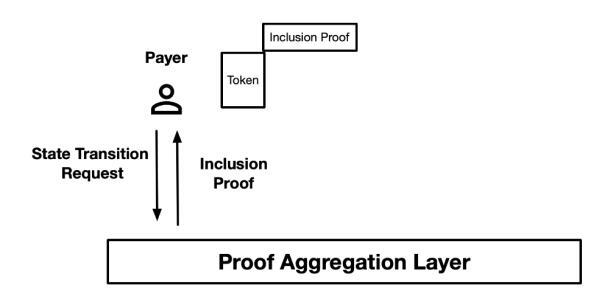
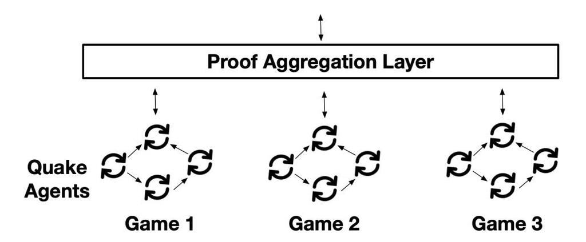
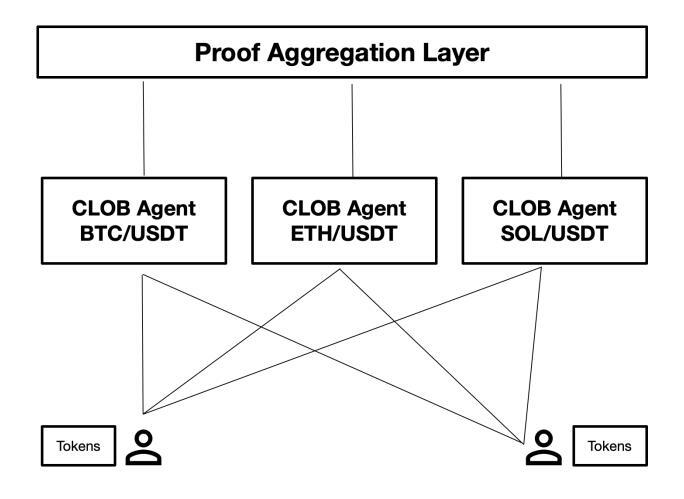
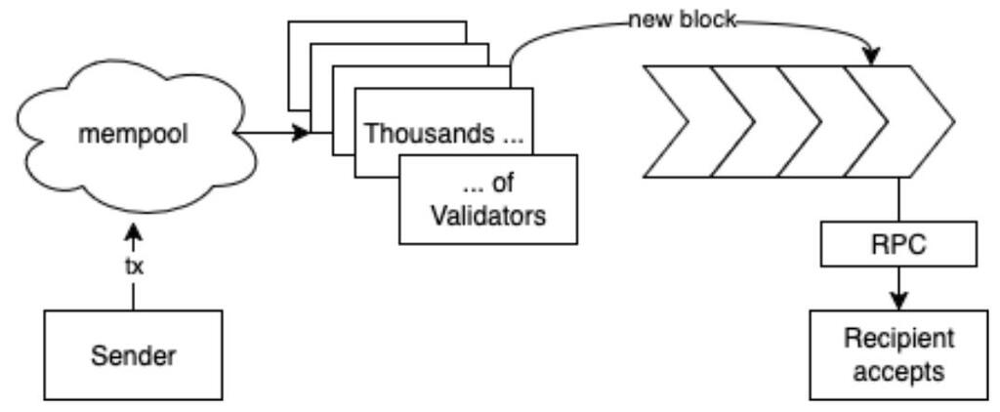
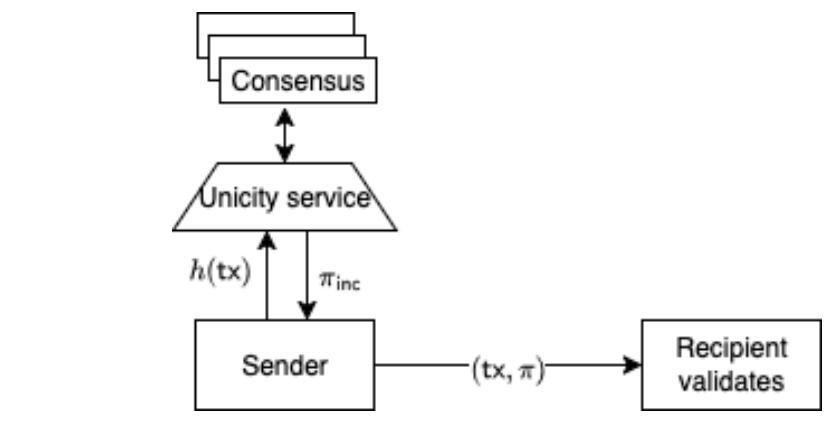

# Unicity FAQ

## What is this and why should I care?

Unicity is a new execution model for blockchain. Every blockchain design, from Bitcoin to Ethereum L2s to modern L1s, relies on a **shared** ledger maintained by a set of validators.

This inevitably leads to competition for resources - there is competition for validator attention, limited space (memory, compute) for storing the assets and executing smart contracts. If you increase the size of the ledger (blockspace) it also requires more computational resources (less decentralized) and if you keep the space a fixed size then competition requires gas fees to deal with increased demand vs limited supply.

Unicity replaces the shared ledger/validator set with a new construct called a uniqueness oracle Each asset (token) is itself a ledger of transactions that lives off-chain on the Internet. The only thing the blockchain does is provide proofs of uniqueness i.e. it prevents the double spending of those assets.

### A Comparison: Bank Accounts vs Physical Cash

Think about the difference between a bank account and physical cash. When you want to make a transfer with a bank account you send a message to the bank and the bank updates its ledger. This is the model followed by traditional blockchains except there is no trusted authority maintaining the ledger. Unicity is like physical cash i.e. you simply hand to the recipient the physical cash. No one else needs to know about it, and it is the recipient's responsibility to verify the authenticity of what they receive.

Like physical cash, Unicity assets are self-authenticating i.e. they can be validated without connecting to blockchains or trusting external parties. The transaction rules i.e. what can happen to these assets, is encoded by the owners into the asset themselves. In other words the assets are untethered to any chain and interoperable across Web2, Web3 and the physical world. The blockchain infrastructure generates proofs for the lack of double-spending, and the resulting proofs are included in the tokens themselves.

### Why should I care ?

There are many reasons why it is worth looking at an alternative execution model. For starters unconstrained throughput, privacy, censorship resistance and massively reduced friction.The friction in crypto is that you need to go on-chain at all.

### User Friction

The objective for Unicity is that crypto should be completely under the hood; users should know nothing about it and just be able to share tokens with contacts, offline or online using email, whatsapp. NFC, QR or whatever.

### Developer Friction

Traditional blockchain development often imposes significant friction, forcing developers to contend with constrained gas fee budget, specialized tooling and bespoke programming languages like Solidity. This creates a steep learning curve and limits the use of familiar, efficient Web2 development practices. Unicity drastically reduces this friction as developers can leverage existing Web2 skills and a vast ecosystem of traditional tooling and platforms for asset creation, management, and application logic.

### Agent Friction (AI Agents):

By making tokens "untethered" and allowing their rules and validation to be executed directly by agents off-chain , it provides tokens with greater "freedom" and efficiency for AI management. The blockchain's role is minimized to crucial, minimal online coordination to prevent double-spending, while the bulk of token rules are executed and validated by agent code directly.

### Throughput

Unicity can achieve orders of magnitude more throughput than traditional blockchains which have to do the heavy lifting of transaction validation. In our system this is the responsibility of the recipient, just like physical cash

### Privacy

There is a lot of research going into making transactions and smart contracts private on blockchains (e.g. Midnight, Zama, Aztec… ) that typically involve complex cryptography and may come with major trade-offs in settlement time and performance.

Unicity offers an alternative approach to privacy. If I meet you in the forest and give you physical cash no one in the world knows about it. It is the same principle behind Unicity, except unlike physical cash in the digital world, we are not constrained by being in physical proximity. Privacy is by design and by default

The same applies for agents (smart contracts). If you play poker in a smoky basement with your friends, no one else in the world needs to know anything about the game.

## Why Token? Why Proof of work?

We use Proof of Work as we can replicate the zero trust security properties of Bitcoin.

Users are capable of validating all aspects of system operation that are relevant to their own assets, as each client functions as a full validator starting from downloading and verifying the PoW blockchain from the genesis block. In other words, If a maximalist user receives a Unicity token they can download the Unicity PoW headers and those headers, when combined with information included in the token allow them to verify, with zero trust assumptions, that they are the correct owner of the token.

Replicating the trust model of Bitcoin is the most important reason but there are others. PoW, especially with RandomX, is the best way to achieve fair decentralization of the network and, in the early stage of the network, PoW is also far more fair and transparent than PoS.

## If tokens are stored locally what happens if I lose my device?

If you are a zero trust maximalist you want complete control without reliance on trusted parties. In this case you take responsibility for the storage of the tokens and your private keys. You can still make backups and store the tokens anywhere as the tokens themselves are useless without the private key.

For regular users they don't need to know what tokens are - app providers can integrate token logic invisibly into existing apps and services. The JSON tokens can be stored in a structured database somewhere.

## How do you detach tokens from other chains ?

Unicity is designed to be chain agnostic. Below is the breakdown of how to mint tokens based on asset types and source blockchains.

- **Native Alpha tokens, mined at the PoW layer**. This is one-way. PoW tokens are 'burned' and the proof of burn becomes the genesis record of a new token off-chain. Because of the shared root of trust, this is really efficient, compact and trustless to verify. Now, transactions can be executed at off-chain speed and without the overhead of globally shared PoW chain.
- **Tokens minted at the Token Layer**. Anyone can mint new tokens (e.g., ERC20 equivalent); the genesis record specifies token parameters, including its total supply, and it is included with each token so that it is possible to verify if the token is uniquely one of the initially minted tokens.
- **Tokens detached from other blockchains**. The exact steps depend on the capabilities of the source blockchain, specifically, the programmability and the efficiency of ZK proof verification ('cryptographic builtins'). Without, a weaker, consensus committee based model is used.

Detaching from **EVM blockchains** uses the lock-mint, burn-release model. There is a source contract for accepting native asset deposits (ETH currency or various ERC-20, ERC-721 tokens). Tokens are locked, and an event is generated based on the locking parameters. The event is captured and proof of validity is generated. The locking event with proof is the genesis of Unicity token layer's mint event.

Crucially, the Unicity Infrastructure does not have to know anything about the source blockchain and does not have to validate the blocks. The validation is performed by the recipients of token transactions. The State Transition SDK allows users to plug in local validation of source blockchain's headers, typically as a light client, or by the use of a trusted RPC node (just like every client of the source blockchain is doing). The first transaction can be validated after waiting for the usual finality time of the source blockchain, subsequent transactions are lightning fast Unicity transactions.

Returning tokens to the source blockchain (burn-release phase) is based on the ZK based token history compression mechanism. All transactions are recursively compressed into fixed size proof of validity; and then the final burning proof layer is added, stating that the specific token's transaction history and the final unicity proof of the burn event are correct. The final proof is returned to the locking contract, which releases the necessary amount of locked tokens upon validation. The final burn-release transaction is executed trustlessly by an external prover network (it is a resource intensive step -- hard to compute, but very lightweight to validate; and this improves gas efficiency due to batching).

On **Solana type** blockchains, due to the efficient cryptographic built-ins, the batching is not necessary; also lock and release phases are much faster.

**Bitcoin** type assets involves consensus committee based security and multi-sig locking scripts.

## How does Unicity compare to L2s?

There is no comparison beyond both being layered infrastructures. To think about Unicity in terms of a traditional L2 it would be equivalent to

1. Every asset (token) would be its own ZK L2 with integrated sequencer
2. There is no need for L2 validators
3. Every L2 transaction would trigger a L1 interaction
4. The L2 itself would be portable and could move around the Internet from user to user.
5. Smart Contracts would be just traditional programs that take L2s as inputs.

L2s were a critical innovation to scale Ethereum and can increase transaction throughput by one or two orders of magnitude before they reach a hard limit. They also introduce additional complexity, centralization (centralized sequencers with escape hatches etc.) with potential security vulnerabilities at the points where they interface with the main chain, and lead to challenges with siloed liquidity, settlement finality and composability.

Breakdown by technical aspects:

- How trust and decentralization propagates downwards. This is closest -- just like ZK L2s, the Aggregation Layer presents proofs of correct operation to L1.
- Reduction of Validation Effort (upwards). Aggregation to Consensus layer: it is enough to show that no commitments were modified or removed during each round. The relationship between Execution Layer and Aggregation Layer has no equivalent: the threat model is limited to denial of service protection (that 3rd parties can not mark others' token states spent). A commitment is an unpredictable hash, there is no concept of it being valid or not. The invalid operation would be certifying one hash twice -- and this is specifically what the Unicity Infrastructure is preventing the Execution Layer from doing.

Traditional L2s prove the validity of individual transactions to L1.

- Reduction of State Space (upwards). Aggregation Layer stores one hash per transaction. Consensus Layer is isolated from user transactions.
- Data Availability. In Unicity, it is the responsibility of each token owner to not lose their assets. On traditional blockchains either L1 or a "modular" availability network must store all transactions.

## Give me a simple explanation of how it works

Proof of Work mines the native currency, handles the tokenomics and provides the root of trust for the layers below, a miner who claims a block reward can mint an equivalent token off-chain.

The Unicity Oracle is the key invention. It is a Merkle tree that adds a leaf to the tree for every transaction that happens off-chain. It returns

- a) Proofs of inclusion (this transaction is registered in the tree and here is a proof that it is registered and was registered only once.
- b) Proof of exclusion (this transaction has not been registered before)

### **Example Use Cases.**

#### Alice transfers a token to Bob

Alice wants to transfer a token to Bob. Alice sends a request to the Uniqueness Oracle and gets back a proof which they append to the token and then sends the updated token to Bob. Bob can then verify that he is the owner of the token and only he can spend it. Bob can verify this with zero trust assumptions and no information about the transfer is available to anyone but Alice and Bob.

#### Alice mints an NFT

Alice's wallet generates a token object in her wallet with all the meta data about the NFT (number of allowed mints, image etc.). Alice sends a mint request to the Uniquness Oracle registering the NFT. After that she can transfer the NFT tokens.

#### Alice plays Quake with Bob.

Alice and Bob download Quake agents and connect to each other (using a p2p network overlay). Alice and Bob transfer tokens to an escrow agent based on the game tokenomics. They start the game and the agents synchronize verifiable game state (the game state is tokenized by periodically registering state transitions in the Proof Aggregation Layer to prevent cheating). Once the game is over the winner claims the tokens from the escrow agent.

## Can Unicity be an L2 of another blockchain?

Yes! But the Unicity Consensus Layer provides specific properties greatly improving the user experience.

- Fast and deterministic finality within a second: there are no 'reorgs' or rollbacks to untangle through the layers below, no wait until enough confirmations. Obtaining an unicity proof for a transaction provides enough certainty to make the transaction verifiable without further interactions with the blockchain.
- Compact root of trust: technically, every recipient of an Unicity transaction is a light client, and having a compact trust anchor is critical to facilitate trustless validation.

A programmable L1 with fast block rate, like Solana, is a good alternative candidate. But there is some loss in convenience due to the token recipient either having to independently establish the validity of Solana block headers, or to trust an RPC node.

## What is actually stored in the blocks?

The Consensus Layer produces a PoW blockchain with the minimum functionality to achieve decentralization. There are no user transactions. Its tasks are: 1) permissionless validator selection for underlying layers, 2) incentives, 3) execution of tokenomics. Headers are the

blocks which contain the standard Bitcoin fields plus a RandomX hash and the Root of the Uniqueness Oracle Merkle tree.

## What can Unicity not do? What are the tradeoffs?

- 1. As there is no shared global state there are no globally synchronized state-dependent operations such as flash loans or MEV.
- 2. Unlike traditional blockchains, there is no public global ledger of asset ownership and unless additional steps are taken the ownership history of a token cannot be traced. For regulated financial markets it is necessary to introduce additional proofs into the token history for KYC/AML procedures, ensuring compliant transfers at each step.
- 3. Traditional blockchains rely on users trusting a validator set who verify computation on the user's behalf. In a client-side model, **the user verifies incoming transactions**. This approach enhances privacy and censorship resistance by eliminating reliance on third-party validators for direct transaction validation. The client's core task is the deterministic verification of these network-anchored proofs and the token's internal consistency - a focused process designed for security and efficiency.

## If there is no shared state how to support atomic transactions ?

**Short answer:**

Predicates. predicates implement a 2-phase commit protocol, where the Uniqueness Oracle Layer provides synchronization support.

**Long answer:**

In general case, parties A, B, C, …, Z plan to perform an "atomic swap" of their tokens with each other. By "atomic swap" we mean that by the end of the swap session, either all tokens change their owners or all of them remain with their original owners i.e. a partial ownership change where some tokens change their owners, while others remain at their original owners should not happen.

For simplicity, in order to explain the core principle, we only consider here A and B exchanging their tokens such that after the "atomic swap" A's token ends up at B's custody and B's token ends up at A's custody. We consider special type of predicate called "escrow" facilitating conditional unlock of the token: A's token can be unlocked and spent to B if B's token has been locked to the analogous escrow predicate meant to be unlocked by A. Thus, successful atomic token swap happens like this: A and B lock their tokens to the respective escrow predicates and demonstrate this to each other. Then, B can unlock the escrow predicate with a token from A by showing to the escrow the proof of the B's token locked to the escrow as well. Symmetrically, A can unlock the escrow with B's token. However, if some of the parties, A or B did not lock their tokens to the escrow predicate within predetermined time window, A or B should be able to reclaim their tokens back by proving to the escrow predicate the counterparty's token has not been locked to the respective escrow predicate. For instance, A can reclaim her token back, if she proves to the predicate that B never locked his token in the escrow. The proof of parties locking their tokens to the escrow predicates is achieved by means of the unicity proof whose position in the Merkle tree is uniquely defined by the respective swap session id and token id. I.e., it is always possible to prove whether a given party has locked or never locked his/her token to the escrow predicate. Note, that we should not present to the escrow predicate the counterparty's token itself, but only the fact that it was (or never was) locked to the counterparty's escrow (unicity proof), thus preserving the local verifiability of all the tokens participating in the atomic swap session.

## If there is no shared state how do smart contracts work?

Programmability is a better term to use than smart contracts. In Unicity there are two models for programmability - single asset programmability, e.g. a multi-sig and multi-asset programmability e.g., a DEX.

Single Assets are programmed using predicates, or functions that return a single TRUE or FALSE. They are used to check if an input meets some condition. For example, isDigit(c) might be a predicate function that returns TRUE if its input character c is a digit and FALSE otherwise.

Predicates are used by assets to enable customization and programmability, similar to Bitcoin locking and unlocking scripts. The most basic form of a predicate that defines ownership would be the verification of a digital signature, i.e., in order to transfer ownership, the signature on the state transition request needs to be signed by a private key that matches the public key stored as part of the predicate.

Shared ownership can be managed through predicates on individual tokens. A predicate might encode a condition saying "next transaction order must be signed by public key A OR B", giving shared ownership semantics. Another example would be a condition saying "next transaction order must be signed by public keys A AND B" giving multisig semantics to ownership.

Predicate evaluation is part of the transaction validation rules – all performed locally by a wallet/agent, without requiring global ordering of transactions or the existence of a shared state.

There can be many types of predicates (an ownership predicate defines ownership, a data predicate defines the mutability of data inside an NFT etc.) but the common characteristic is that they are applied at the token level. They exist as part of the transaction validation rules for individual tokens.

For multi-asset programmability Unicity introduces agents, see next section.

## Is there anyone else doing something similar to you?

The closest we have seen to the architecture of Unicity is the RGB protocol in Bitcoin. However, its goal is to bring a richer execution model to Bitcoin, for every complex transaction there is still a transaction on Bitcoin blockchain, thus there is no scaling of the number of transactions or decrease in the time to finality.

Certainly, there is a trend in the industry to move part of the computation off-chain, as seen in projects like Polkadot JAM, Polygon Miden (the ZK-powered "edge" blockchain) etc. However, these approaches take half-steps and are still constrained by the architecture that they were originally designed for, which assumes anyone can validate everything. Unicity enables universal, industrial-scale off-chain computation, mainly because parties validate only the transaction and infrastructure aspects concerning themselves specifically.

Client side ZK, e.g. Aleo, Aztec, etc. are attempts to use ZK to prove client side computation with the focus of adding privacy to publicly verifiable transactions. However, the risk is that ZK becomes part of the critical path of transactions and the overhead of ZK impacts the user experience. Unicity's design uses client-size ZK for asset state compression but not as part of the transaction critical path. Privacy is achieved through transaction specific blinding masks which are far easier to compute.

Our mission is to be a neutral, chain-agnostic layer that enhances the entire blockchain ecosystem. By focusing on universal data objects encapsulating either native or wrapped external assets and peer-to-peer transactions, we were able to restrain transaction processing, validation, and asset storage to strictly the parties who are interested and incentivized to do so. There is no need for global validation of all aspects of transactions. This unlocks unprecedented throughput and delivers a seamless, frictionless experience across all blockchain networks—supporting industry growth and innovation as a whole.

## Walk me through a transaction

There is the technical flow and the user experience. If a user needs to know anything about the details we have failed.

Android wallet code is here: <https://github.com/unicitynetwork/android-wallet>

### Simple explanation

Payer A wants to transfer a token to Payee B. A's wallet generates a state transition request that updates the ownership of the token to B. Then their wallet sends the state transition request to the Unicity infrastructure Proof Aggregation Layer and gets back an inclusion proof, i.e. a response from the infrastructure that says the state transition request has not been seen before and is now recorded in the chain. The key point is that a state transition request can only be registered once. If the payer tries to double spend the coin the second request will not get back a valid inclusion proof.

The inclusion proof is then added to the token and sent to the Payee who can verify with different levels of trust assumptions, that the token and proof is valid. At that point only the Payee can execute a valid transaction to further spend the token.

The token can be sent through any channel: email, SNS, messaging app, NFC etc.

### More Technical Description

Suppose the payer A has a token T and wants to send it to the payee B. Let's first examine the steps needed in the online payment case and then review the offline cases. In all cases, the fact that A owns the token is denoted by the token's "owner predicate" attribute (the "locking script"

in Bitcoin terminology) being "the next transition of this token must be signed by A" (where A is identified by their public key).

In case of simple online payment, the transfer of T from A to B happens in the following steps:

- A requests transfer of T to B from their wallet.
- A's wallet creates a state transition that replaces the current owner predicate with "the next transition must be signed by B" and signs the transition with its private key.
- A's wallet posts the transition to the validators and receives a proof that the transition is now included in the system state (maintained in the form of an SMT); the inclusion proof also implies (1) a confirmation that there was no other transition from the same state (T owned by A) registered previously, and (2) a promise that no other transition from the same state will be accepted in the future.
- A's wallet appends the signed transition and the inclusion proof to the token's history and sends the whole package to B's wallet.
- B's wallet validates the chain of transitions from the token's creation to its current state (which now contains the owner predicate "the next transition must be signed by B") and accepts it as payment only if all the transitions have been properly signed and have valid inclusion proofs.

### High Frequency Trading

If there is a need for high-frequency low latency trading then the protocol can be modified such that the Payer generates a commitment (a digital signature authorizing the transfer) and sends that plus the token to the Payee. In this case it is the Payee's wallet that creates the state transition request that is sent to the Unicity Infrastructure Proof Aggregation layer. It receives back an immediate exclusion proof (i.e. this state transition has not been registered before and is now scheduled to be registered). Approximately 2 seconds later the Payee will receive an inclusion proof and the token can be further spent.

The advantage of this approach is that once the exclusion proof is received the Payee can take action with a high degree of certainty that inclusion proof will arrive approximately two seconds later.

## Walk me through an offline transaction

Here is the actual user experience for an offline payment: <https://youtu.be/ufpySNMCpsU>

Offline transactions are possible when some additional conditions are fulfilled and eventually each transaction that was initially executed offline will also be posted online. Currently there are two sub-protocols defined for offline transactions.

The first protocol is based on certified hardware. The additional condition in this protocol is that the payers in offline transactions have such hardware and the payees in offline transactions trust the hardware to operate correctly (even though the payer who controls the device is incentivized to tamper with it). If the recipient of such an offline payment also has a certified hardware wallet, they can issue further offline payments with the received tokens without needing to go online. In case a device is breached, the protocol allows identifying the malfunctioning device (and thus also its owner/operator) when a sequence of offline transactions is eventually posted online by the final recipient.

The second protocol does not assume special hardware, the double-spending check is performed by the recipient. The additional condition in this protocol is that the payer needs to take extra steps while still online to prepare for the offline transactions. In this protocol, the payer needs to know the identity/identities of the payee/payees and lock sufficient tokens for each pote in ntial payment in advance. If a payment takes place, the payee will get ownership of the corresponding tokens and can execute further transactions with them when they get online. If a payment does not take place, the payer regains control of the corresponding tokens when they get back online.

### Certified hardware

The first protocol is based on certified hardware. The starting point is once more that the token's owner predicate is "the next transition must be signed by A", but with the additional provision that the private key of A is managed by a specifically designed signing module and is not directly accessible by the user. A digitally signed certificate on the public key (issued by a trusted authority) confirms that the corresponding private key is managed this way. The transfer then happens in the following steps:

- A requests transfer of T to B from their wallet.
- A's wallet creates a state transition that replaces the current owner predicate with "the next transition must be signed by B" and has the signing module sign the transition.

- The module keeps a cryptographic summary of the source states of all transitions that it has ever signed and checks that the state (T owned by A) is not among them. If the state has already been spent previously, the module refuses to sign the new transition. If the state is not previously spent, the module signs the transition and adds the state to its cryptographic summary. (Essentially, the module is a mini-validator just for the subset of transitions initiated by A.)
- A's wallet appends the signed transition and the certificate on the public key to the token's history and sends the whole package to B's wallet.
- B's wallet validates the chain of transitions from the token's creation to its current state. Each transition must be signed by the previous owner and accompanied by either an online inclusion proof or a certificate of the signing module.
- In this case, a chain of offline transitions may continue either indefinitely or up to some limit defined by the risk management policy of the signing modules (indicated in the corresponding certificates).
- Eventually some final payee X will be online. Then X's wallet can post all the offline transitions to online validators and replace the certificates of the signing modules with the inclusion proofs received from the validators.

See a detailed description of the offline payments model here: [Unicity\\_Offline.pdf](https://drive.google.com/file/d/1eY3sYs_wpGehqzau-7M04mTU8TpaR_Bv/view?usp=sharing)

### Recipient Checks

The second protocol does not assume special hardware, the double-spending check is performed by the recipient. The additional condition in this protocol is that the payer needs to take extra steps while still online to prepare for the offline transactions.

The steps are as follows:

- Before going offline, A instructs their wallet to lock some amounts of tokens for some specified recipients for some time period.
- To prepare for possible offline payment of token T to B, A's wallet creates, signs, and posts to validators a transition that changes the owner predicate of the token to "if the next transition is posted before deadline D, it must be signed by B; otherwise it must be signed by A". A's wallet then appends the transition and its inclusion proof to the token's history locally in the wallet's own storage. (It is important for the security in this case that

- when a transition is posted to the validators, the token's new state is represented by a hash value and the state itself does not become public.)
- If A orders their wallet to execute the payment, the wallet sends the whole package to B's wallet. B's wallet then has to go online before the deadline D and can execute any valid transitions (including taking unconditional ownership of the token by replacing its owner predicate with "the next transition must be signed by B").
- If the payment does not take place, A just needs to refrain from sending the token to B. After the deadline D passes, control of the token reverts back to A (the next transition has to be signed by A again).

Note that in both scenarios, the transitions initially executed offline will eventually be registered online and the token states will no longer need to contain any special conditions.

### Walk me through how an Agent works

Agents are the Unicity equivalent of smart contracts. In fact you could run an EVM inside an agent so they can be identical to Ethereum smart contracts. Agents can run an AMM, they can run a CLOB - the major difference is they run in parallel off chain. Let's take the example of Quake

There are 3 games of Quake with 4 players in each game. The game is running inside an agent locally on each player's device (in a browser). The agents use the Proof Aggregation Layer to create state transitions for tokens to transfer among each other and also to verify the game state of other players (e.g. they aren't creating fake weapons or jumping through walls). These games are running off-chain and in parallel.

The Unicity agent is effectively a wrapper around the game code which captures its state and allows p2p transfers of state (e.g. tokens) between players. This is important as there is no need to port the games - we can bring the functionality of Web3 to Web2 gaming with just an SDK

Next example would be a CLOB

In this case the two parties transfer their tokens conditionally to a CLOB agent "I want to swap my ETH and am willing to swap it for USDT at 2400 USDT or better. If the transfer doesn't happen within X seconds the order is cancelled". Those tokens are transferred to the CLOB Agent (using any p2p networking protocol) and if the Agent finds a match then the tokens are swapped and returned to the users.

It is easy to extend this to any application for example to build a fully-decentralized financial institution, composed of agents, operated by a community and fully censorship resistant.

## What are the biggest security threats and how are you dealing with them?

The biggest threat is a different execution model – application developers have to adjust to it: validate all incoming token transactions (with provided SDK); Token-level security is enforced by locking predicates, but this requires developers to provide external context and agent runtime to the tokens, with some risk of failing to understand the model and rendering tokens locked forever.

## How to implement the major primitives in traditional blockchains?

In the following description predicate is just like a bitcoin locking script. Predicate is a part of a token state and defines programmatically unlocking conditions for the token to be transitioned into a new state. Technically, predicates are expressions that evaluate to TRUE or FALSE when being provided the respective inputs by external parties (users or programs/agents). For example, isValidSignature(content, pubkey, signature) will return TRUE or FALSE depending if we provided valid 'signature' for the 'content' whose signer's public key corresponds to 'pubkey'.

Transfers - described above.

**NFTs** - an NFT minter simply creates tokens off-chain using the SDK. They can be stored anywhere as part of a collection - a Web2 app like OpenSea, google drive, a Unicity Agent etc. The keys to transfer them remain local to the owner just like in regular blockchains. The genesis record specifies meta-data, like the maximum number that can be minted etc.

**SWAP**: generic multiple token exchange protocol where all participants either swap with each other all the tokens or no token participating in the swap event changes their owner. This protocol is implemented by the type of predicate called "escrow" that encodes specific token unlock conditions, where the other party unlocks the escrow predicate and claims the token if all the tokens participating in the swap event have been committed to the escrow predicates and other case-specific conditions have been satisfied. Otherwise, if at least one of the swapping conditions has not been satisfied, every token owner can reclaim their tokens back (no swap happens).

**CLOB:** is an agent facilitating the exchange protocol. A party who wants to trade its token transacts it into the address referencing the escrow predicate generated by the CLOB agent. The escrow predicate encodes the trading order exchange and settlement conditions such as exchange rates, time frames, etc., as well as requests for CLOB providing proofs of correct and fair order matching and tokens atomic swap/settlement conditions (trading parties A and B can swap their tokens if both have locked their tokens into escrow predicates). The settlement happens offchain and between the trading parties that follow SWAP protocol described above. Multiple parties execute settlements independently from each other and in parallel.

DEX is a set of agents executing the logic of AMM, but producing verifiable certificates proving their correct and fair execution. Each liquidity pair is being served by a separate agent, where tokens with the liquidity getting locked by an escrow predicate. That predicate encodes unlocking conditions such as fair exchange with the correct rate to a token with the opposite liquidity. In this manner, the AMM pair-liquidity agent maintains the pool of tokens storing the respective liquidity tokens and facilitates the tokens exchange with a trader party by applying swap protocol.

**Lend/Borrow:** can be implemented as a version of DEX, where a token to be lent is being exchanged for the collateral token. Then, before the due time token carrying the equivalent borrowed value can be exchanged back to the collateral token. The agent facilitates execution of the lending protocol, but the escrow predicate encodes the lending conditions.

**Staking / Yield Farming:** extension of the DEX protocol from above with escrow encoding staking and yield farming. Participants deposit their tokens with the relevant liquidity to the relevant DEX agent locked under the escrow predicate with the relevant staking conditions. Based on that, the farmers can periodically claim/unlock tokens carrying the respective rewards. The job of a DEX agent is to enable sharing and communication of the tokens and escrow predicate generation. It is up to the farmers to verify that all the escrow predicates generated by the DEX agent are correct and satisfy the farmers' interests.

**Identity / Reputation**: similar to ENS, in Unicity we have so-called nametag tokens that are addressable self-authenticated data structures encoded within Unicity tokens and are mapping arbitrary names into app-specific values (like addresses, personal data, etc.). Unicity assures that once someone has claimed a specific name (minted the nametag token), it will never be possible to claim the same name by someone else again. Nametags are not public and are stored locally by the nametag owner or any interested party. The reputation system may be implemented since the token can store app-specific data that can be modified (authorization as usual by means of the state predicate). In particular, we can store some reputation information certified by the respective reputation protocols.

**DAOs:** those are Web2 apps, but all the web-app logic implemented on the agents that perform verifiable computations on the clients' and interested parties' machines rather than within some provider's facilities or on central servers. The agents' computations being tokenized and traced within Unicity tokens. Also, agents can store and transact other tokens (for instance those that carry currencies, assets or anything else of value).

**Bridges:** one of the core outcomes of the Unicity architecture design is that tokens generally are not being linked to a specific chain, a token transaction may require Unicity proof not necessarily from the Unicity chain, but from other chains (Ethereum, Solana, Sui, etc.) or even from certified trusted hardware environment instances. In this manner, we can implement trustless asset migration between different blockchain platforms.

**Oracles**: Implemented as a network of agents committing and certifying on some data (like, readings of real-world data, VRN generators, etc.)

Where Agents are needed: anywhere where verifiable app logic needs to be executed and tokens state transitions should be triggered and tokens to be communicated to the interested parties. Agents facilitate multi-token protocols, like those based on SWAPs.

## Does Unicity have transaction fees? How is the system sustained?

The native currency provides democratic decentralized security through RandomX Proof of Work and platform utility enabling developer access to network services.

The token design is still under construction but one approach we are considering is that developers will pay a subscription to access the Proof Aggregation Layer based on bands. I.e. up to a certain number of requests per month is free etc. The subscription model will be designed in a permissionless way i.e. a developer sends native currency tokens to a burn address and presents that proof to the infrastructure to access the service.

The infrastructure operators (BFT nodes, SMT operators) will receive a percentage of block rewards to compensate them for their work.

As the infrastructure is simply registering a hash value in a SMT the cost per transactions is fantastically low, less than \$0.00000001 per transaction

## How do I start a transaction with someone else?

Do they have a wallet address?

Users can register other users by phone number or email address or whatever. You don't need a wallet address to receive tokens. Tokens can be set up as digital bearer instruments (i.e. no owner) or given advanced programmatic conditions for ownership. Here is an actual token for example

https://gist.github.com/MastaP/666d9765b32c58bc9621a8acf7b4bb46

We have designed a "name tag" mechanism that allows a user's name (or other identifier that makes business sense) to be resolved to their technical wallet address.

If you're both online, physical distance does not matter. Your wallet can use any suitable communication mechanism to send the updated token to the recipient's wallet. For offline payments, you indeed need to establish some point-to-point link between your wallets.

## How can Unicity be so efficient?

Unicity is designed to achieve optimal efficiency and full decentralization, while operating within practical parameters. This is achieved through a hierarchical architecture, where the Consensus Layer provides decentralization, and security is propagated downward—-similar to how traditional Layer 1 blockchains (L1s) secure Layer 2 (L2) ZK-Rollups. Simultaneously, the arrangement reduces the amount of data and computation effort when upper layers validate the correctness of layers below.

Transactions are validated only by their recipients—the most interested parties. There is no need for a shared global state, since each incoming transaction carries all the context required for validation.

The Proof Aggregation Layer merely records the existence of spending transaction of a particular asset, significantly reducing the validation effort. The security model requires Aggregation Layer to not forget registered unicity proofs - and nothing more. This is far more efficient to prove cryptographically, compared to full transaction validation by L2 rollups.

The Consensus Layer validates the per-batch state transitions of the Aggregation Layer. Due to the system's cryptographic consistency and non-deletion proofs, there is no risk of illegitimate

manipulation. Consequently, only a few machines per Aggregation Layer shard are required to provide sufficient security. The Consensus Layer's blockchain is minimal, containing only what is necessary for decentralization and tokenomics; it does not handle any user transaction-related data.

The consequence is that the transaction processing path is much shortened and there are far less validators performing redundant verification than traditional blockchains. See the Figures below.

Figure: Transaction flow of a "traditional" blockchain

Figure: Transaction flow in Unicity