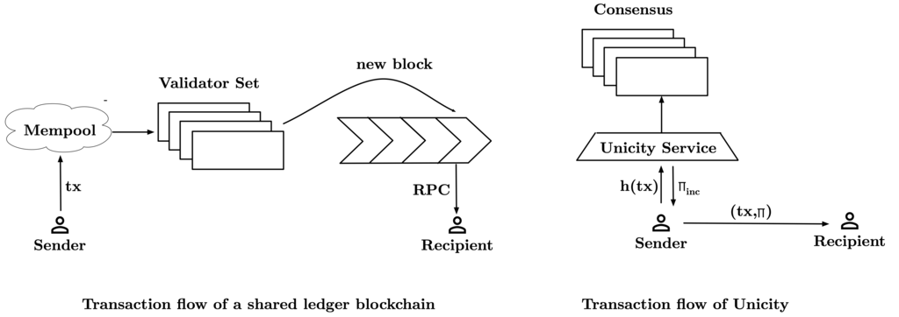
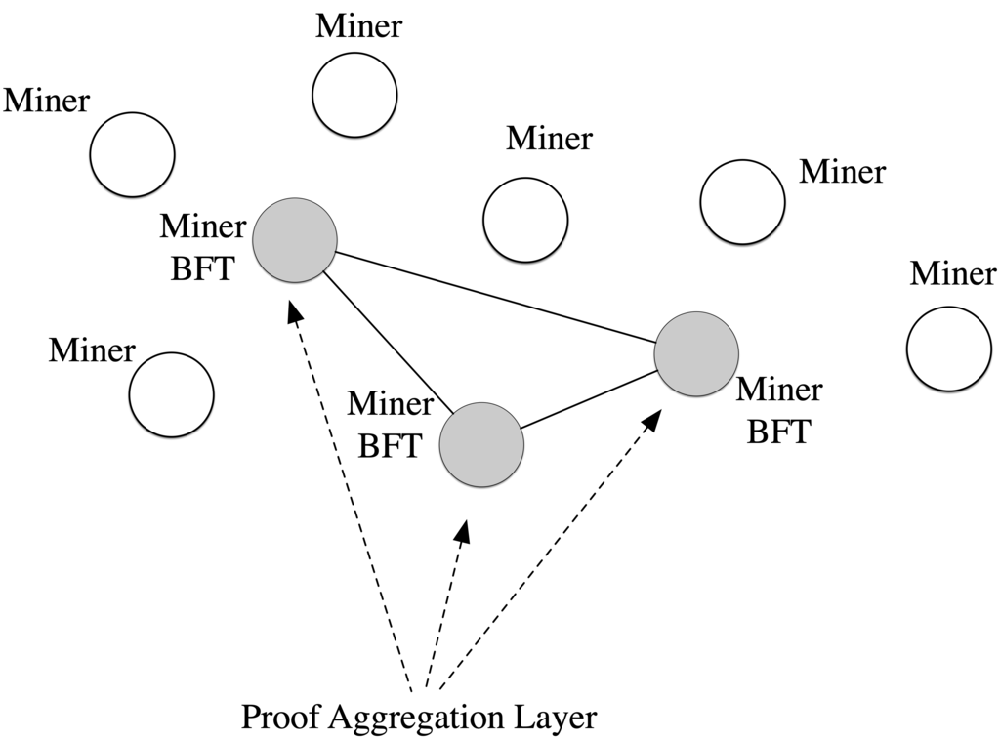
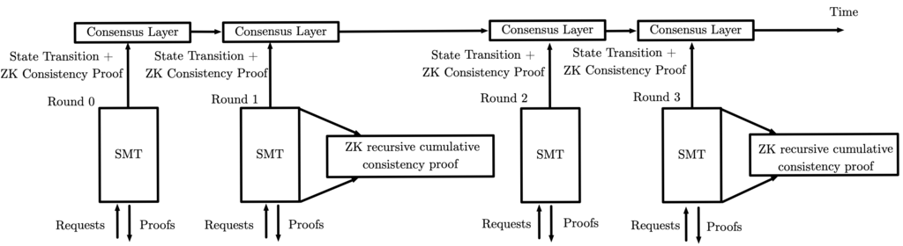
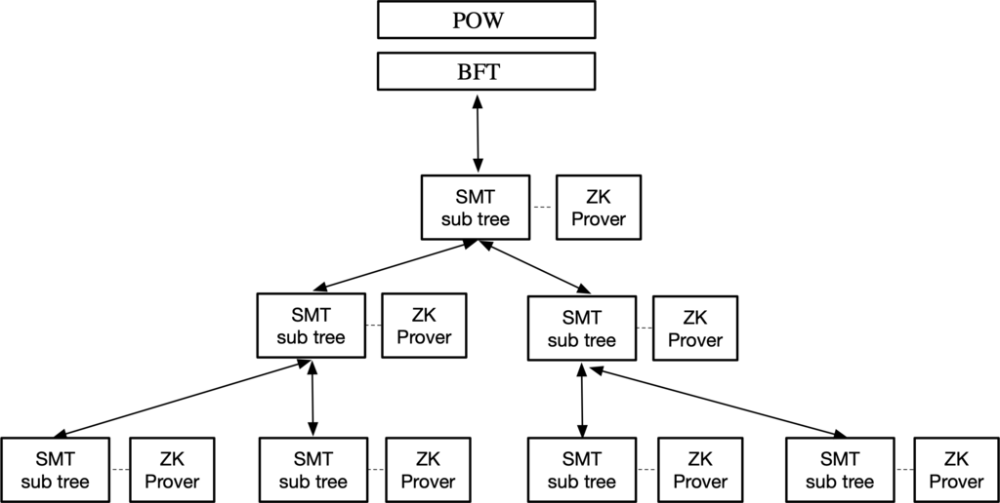
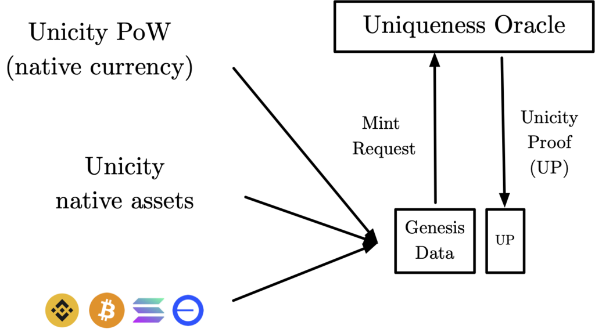
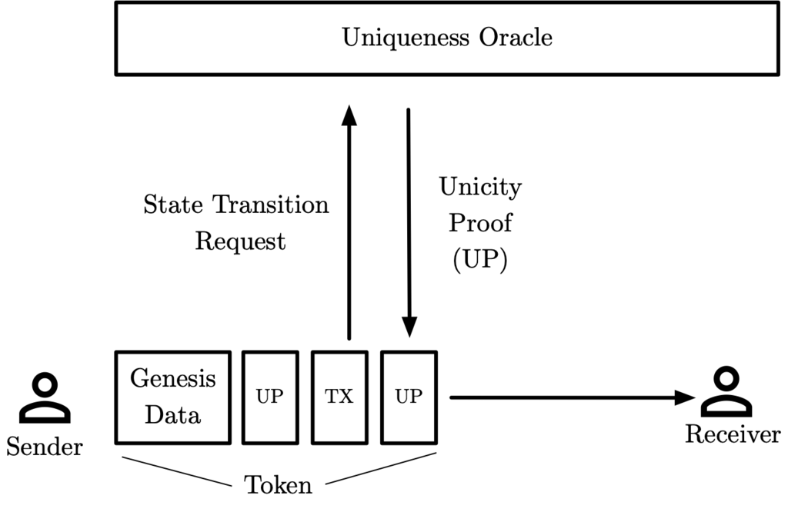
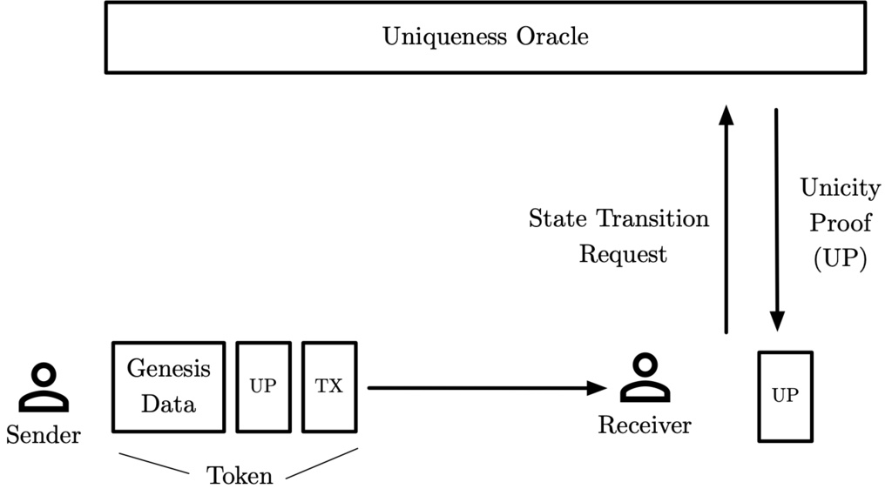
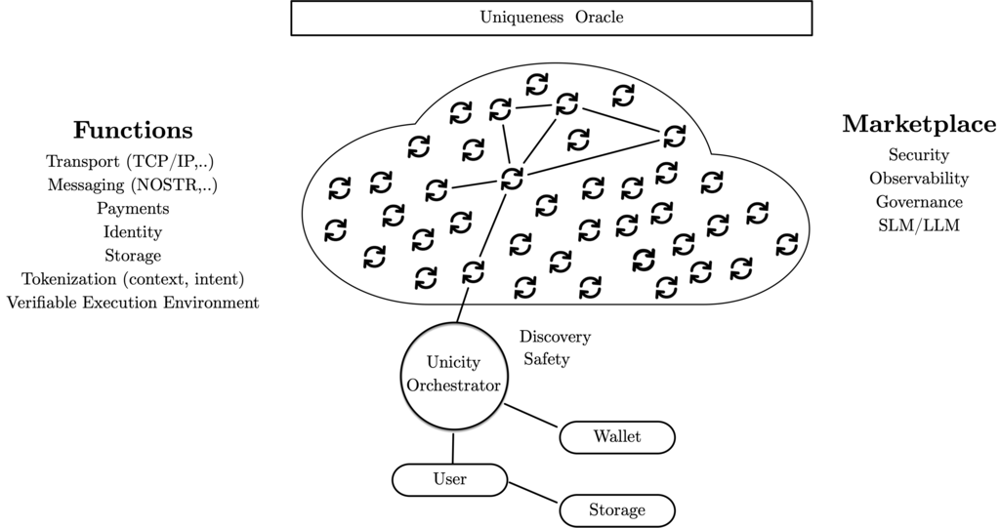
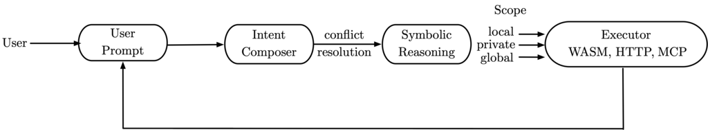
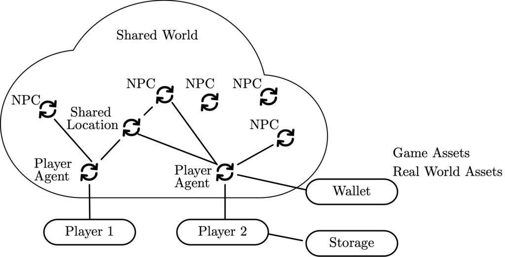

## What is Unicity

- **Blockchain:** Reduced to the minimum necessary to prove the absence
  of double spending. RandomX Proof of Work, BFT finality. No
  transactions, no mempool, no wallets. 2.4 hour block times (\<1MB
  state/year). Root of trust for layers below and native currency
  genesis.

- **Uniqueness Oracle:** Public permissionless infrastructure
  maintaining an append-only sharded Sparse Merkle Tree (SMT). Users
  send cryptographic digests of transactions and are returned proofs of
  inclusion (transactions have been recorded) and proofs of exclusion
  (transactions have not been recorded before). The SMT is anchored in
  the blockchain, built hierarchically and operates in rounds. A
  recursive ZK prover is used to prove consistency of the SMT.

- **Tokens:** Verifiable state. Self-contained ledgers of individual
  assets that are minted directly off-chain or detached from other
  blockchains. To execute a transaction, a payor will send a transaction
  request to the uniqueness oracle and receive back an inclusion proof
  which is appended to the token. The payor then sends the updated token
  directly to the payee. Similar to physical cash in that only the payee
  is responsible for verification.

- **Verifiable Agents:** The power of smart contracts without the
  bottleneck of shared state. Tokens are conditionally transferred to
  agents which execute and re-distribute tokens with proofs of execution
  and uniqueness. Unlike smart contracts bound to a single chain, agents
  are portable runtime-agnostic entities that can migrate between
  execution environments while maintaining cryptographic continuity.

- **Intelligent Agents:** Agents augmented with inference for intent
  interpretation, planning, and adaptive behavior. The verifiable
  execution environment ensures cryptographic verifiability while
  inference enables natural language interaction and autonomous
  decision-making. Probabilistic inference is constrained by strictly
  typed program graphs (neuro-symbolic logic) ensuring every decision,
  connection, and outcome is explainable, traceable, precise, and
  verifiable.

- **Agentic Internet:** A decentralized platform for autonomous agent
  operations. Agents can be developed, deployed, discovered, and
  orchestrated without centralized gatekeepers. Protocol agnostic P2P
  transport. Decentralized storage where agents carry state in tokens
  rather than host filesystems. Integrated micro-payments and
  infrastructure marketplace for storage, compute, bandwidth, and
  proving services.

## The Agentic Economy

Agents are becoming autonomous economic actors. Today they operate
within human workflows -- writing code, executing trades, managing
documents on command. The trajectory points toward full autonomy: agents
that operate continuously, making decisions and taking actions without
human oversight.

Autonomous economic actors face two fundamental challenges.

The first is transactional. Autonomous agents need infrastructure to
transact and cooperate without trusted intermediaries. Traditional rails
cannot serve them: banks require human authorization, payment processors
reverse transactions, contracts require courts. Autonomous agents cannot
rely on reputation, legal recourse, or human judgment to resolve
disputes. They need infrastructure where correctness is guaranteed
cryptographically -- where agreements execute according to mathematical
rules rather than institutional permission.

The second is behavioral. Autonomous agents making decisions with
economic consequences: trading, allocating resources, entering contracts
must be trustworthy. Counterparties need assurance that agent behavior
is correct, explainable, and bounded. A trading agent that hallucinates
a price, a supply chain agent that fabricates a supplier, a governance
agent that misinterprets a proposal -- each can cause real economic
harm. Agents operating without human oversight require architectural
guarantees that their decisions are verifiable and their actions are
constrained to declared capabilities.

Blockchains are a solution to enabling trustless transactons:
permissionless networks where agents transact without gatekeepers and
enforce agreements through smart contracts rather than legal systems.
But every blockchain since Bitcoin implements these properties through a
shared ledger -- a public record maintained by validators who must
process, order, and witness every transaction. For humans who transact
infrequently and tolerate friction, this works. For autonomous agents
requiring continuous transactions at scale, immediate finality, and
privacy from observers, it does not.

Neuro-symbolic AI has emerged to address the behavioral challenge. By
combining neural networks with symbolic reasoning, neuro-symbolic
systems constrain probabilistic inference within formal logical
structures. Neural components handle perception and natural language --
tasks where statistical learning excels. Symbolic components handle
reasoning and execution, tasks requiring precision, consistency, and
explainability. The approach enables AI systems that generalize like
neural networks while remaining verifiable like traditional software.
But neuro-symbolic AI alone does not solve the infrastructure problem:
verifiable agents still need a way to transact, hold assets, and prove
their behavior to counterparties at scale.

What is missing is an architecture that addresses both challenges
together. Transaction infrastructure that operates at machine scale
without trusted intermediaries, combined with execution infrastructure
that makes agent behavior cryptographically verifiable.

## Unicity Architecture Overview

This paper introduces Unicity, an architecture built on two foundations.

**Unicity Blockchain** solves the transactional challenge. By
eliminating the shared ledger entirely, Unicity enables peer-to-peer
value transfer without intermediary validation. Assets become
self-contained cryptographic objects that move directly between parties,
verified by recipients alone. There is no validator set processing
transactions, no mempool exposing pending operations, no public ledger
recording the exchange. The result is unlimited throughput, immediate
finality, and privacy by default.

**Neuro-Symbolic Execution** solves the behavioral challenge. By
separating neural interpretation from symbolic execution, Unicity
constrains agent behavior to typed, deterministic operations. Neural
components handle intent, parsing natural language, identifying relevant
actions. Symbolic components handle execution, type-checked operations
with cryptographic proofs of correctness. The result is intelligent
agents whose decisions are explainable, whose actions are bounded to
declared capabilities, and whose outputs carry cryptographic proof that
execution followed the rules.

Together, these foundations enable the Autonomous Agentic Internet: a
decentralized platform where agents transact at scale with privacy, and
where counterparties verify agent behavior without trusting the agent or
its operator.

The architecture is presented in three parts:

**Part I: Blockchain** introduces the Unicity blockchain. A new design
that reduces on-chain state to the minimum necessary to prove uniqueness
of off-chain transactions. Assets move peer-to-peer as self-contained
cryptographic objects, verified by recipients alone.

**Part II: Agentic Infrastructure** describes the computational entities
that operate on this foundation. Tokens, Verifiable Agents, and
Intelligent Agents, along with platform services including the
Neuro-Symbolic Orchestrator, peer-to-peer transport, decentralized
storage, and micropayments.

**Part III: Applications** demonstrates decentralized applications built
on this infrastructure: finance, commerce, and gaming.

*A note on terminology:* Within the AI community, "agent" has come to
mean an LLM with tool-calling capabilities. We use both this and the
traditional computer science definition. Verifiable Agents are
autonomous computational entities in the traditional sense with
cryptographic execution guarantees. Intelligent Agents extend Verifiable
Agents with LLM inference -- the modern sense. Both can hold tokens,
transact, and cooperate autonomously. The terms are used interchangeably
except where the distinction matters.

## Unicity Blockchain

### A Non-Shared-Ledger Blockchain

Satoshi's whitepaper was titled "Bitcoin: A Peer-to-Peer Electronic Cash
System." Seventeen years later, we have neither. Not peer-to-peer: every
transaction must pass through miners/validators[^1]. Not cash: every
transaction is recorded on a public ledger. Physical cash is
self-contained, transferable directly between parties, verified by the
recipient alone. No third party processes the transaction or records it
in a ledger. Blockchains have replaced trusted institutions with
decentralized validators, but the fundamental model remains unchanged: a
set of intermediaries who see every transaction, process every transfer,
and maintain a ledger on behalf of participants.

The validator set operating on a shared ledger is also the fundamental
bottleneck through which all economic activity must flow. Throughput is
limited by what validators can process. Latency is determined by how
fast validators reach consensus. Privacy is challenging when validators
see every transaction. Fees emerge from competition for validator
attention. Censorship becomes possible because validators choose what to
include.

This is true for all Layer 1 implementations. Bitcoin, Ethereum, Solana,
Sui, Monad, and every other major blockchain maintain a single shared
ledger. Each optimizes for different points across the
decentralization-security-scalability tradeoff space, yet all remain
constrained by the same fundamental architecture: a shared ledger
managed by validators.

Proposed optimizations reproduce this model at different scales. Layer 2
solutions move execution off-chain but route transactions through
centralized sequencers who see, order and periodically settle to the L1.
Sidechains create separate ledgers with their own validator sets.
Sharding partitions state but maintains validators within each shard.

<figure id="fig:layers" data-latex-placement="htbp">

<figcaption>Transaction Flows</figcaption>
</figure>

Unicity is an attempt to eliminate these constraints by enabling true
peer-to-peer value transfer without intermediary validation. Like
physical cash, assets in Unicity are self-contained cryptographic
objects that can be validated independently by their recipients.
Transactions occur directly between parties without broadcasting to a
network, waiting for consensus, or paying gas fees. The recipient bears
responsibility for validation -- examining the cryptographic proofs
embedded within the asset itself -- just as one might verify a physical
banknote's authenticity. The blockchain's role is minimized to providing
cryptographic proof of uniqueness, ensuring these independent assets
cannot be double-spent as they traverse the network directly between
parties.

This fundamental shift from "assets on a ledger" to "assets as
independent entities" enables true peer-to-peer transfer without any
shared state infrastructure. Each asset can move, be validated, and
execute logic completely independently of all other assets in the
system. Parallelization becomes unlimited not because execution is
separated from consensus, but because there is no shared state to
coordinate at all -- each asset operates in its own computational
space, interacting with others only when explicitly required by
application logic.

The result is an architecture that combines the desirable properties of
both physical cash and distributed ledgers: the simplicity and finality
of bilateral exchange, the privacy of direct transfer, the efficiency of
parallel execution, and -- when needed -- the composability and
coordination of shared state (through agents). This design philosophy
directly addresses the requirements of machine-scale economies, where
billions of autonomous agents must transact continuously without the
friction of global coordination.

## Unicity Blockchain Architecture

Unicity implements a hierarchical architecture designed to minimize
on-chain overhead while maintaining the security guarantees of a
permissionless blockchain. The system separates concerns across three
distinct layers, each optimized for its specific function.

<figure id="fig:arch" data-latex-placement="htbp">

<figcaption>Unicity’s layered infrastructure</figcaption>
</figure>

The Consensus Layer provides the system's root of trust through a
minimal "headers only" Proof of Work blockchain.

The Uniqueness Oracle represents Unicity's core innovation: a mechanism
for proving that off-chain assets have not been double-spent without
recording the transactions themselves. This layer generates
cryptographic proofs -- unicity proofs -- that certify the
non-existence of conflicting transactions for any given asset. These
proofs are anchored to the Consensus Layer's timeline but do not require
recording transaction details on-chain.

At the agent layer, tokens exist as independent cryptographic objects,
functioning as independent blockchains. A token carries its complete
validation rules, state, and transaction history within itself. The
Uniqueness Oracle ensures these independent chains cannot fork, while
the Proof of Work consensus provides the same trust model as Bitcoin --
recipients can independently verify ownership with zero trust
assumptions. Assets move peer-to-peer across the network, requiring no
global coordination or shared ledger for transfer.

Agents serve as Unicity's equivalent to smart contracts. Agents receive
tokens from users or other agents, redistribute ownership based on
application logic and generate a proof of correct execution.

### Hierarchical Efficiency

This hierarchical design achieves optimal efficiency through careful
separation of concerns. Security and decentralization flow downward from
the Proof of Work consensus layer, providing a trusted foundation for
all operations below. Meanwhile, the volume of data flowing upward is
minimized -- only cryptographic proofs of uniqueness need to be
anchored to the consensus layer, not the transactions themselves.
Table [1](#tab:layers){reference-type="ref" reference="tab:layers"}
illustrates how this architecture distributes computational and storage
overhead across layers, enabling the system to support machine-scale
transaction volumes while maintaining the security properties of a
permissionless blockchain.

Tokens are self-contained; no external blockchain needs to be consulted
for validation. Validation is the responsibility of the transaction's
recipient -- the party with a direct interest in its validity -- who
is also responsible for their own token storage.

| **Layer**  |   **Responsibility** |  **Secured by** |  **Storage** |**Redundancy**|  **Effort**
| Consensus: PoW & tokenomics | PoW      |     200 B/day |          PoW mining | Tokenomics |
| Consensus: BFT | finality    |  $\uparrow$ |          100 B/day | $\approx21\times$ |
| Uniqueness Oracle | consistency proofs | $\uparrow$ |           50 B/tx | Few replicas | Proof generation |
| Uniqueness Oracle | state transitions | $\uparrow$ |           50 B/tx | Few replicas | Proof generation |
| Token Operations | User transactions | $\uparrow$ & recipients | Own tokens | Recipients | Relevant transactions |

Table: Unicity's layers, their roles and decentralization overhead

### Consensus Layer Implementation

<figure id="fig:PoW" data-latex-placement="htbp">

<figcaption>Consensus Layer with Proof of Work trust anchor</figcaption>
</figure>

Proof of Work remains unsurpassed as means to launch a fault tolerant
decentralized censorship resistant network. It ties the security of the
system to a physical quantity (energy) and enables tokens to be fairly
and transparently distributed without human oversight.

To prevent centralization of mining power, new ASIC-resistant hash
functions have been developed, of which RandomX represents the state of
the art, having been battle-tested in Monero, a privacy preserving
cryptocurrency. Unlike Bitcoin's SHA-256 algorithm, RandomX is designed
to be ASIC-resistant and CPU-friendly, leveling the playing field and
helping maintain a decentralized network of miners. This democratization
not only improves network security through wider participation but also
upholds the original Bitcoin vision as a decentralized financial system
accessible to all. RandomX works by generating random code for each
mining round, including a variety of CPU instructions, memory-hard
operations and random code execution that can be efficiently performed
by general-purpose processors but are challenging to optimize in
hardware. This ensures that CPUs remain competitive in mining,
preserving the network's decentralization and resistance to the
concentration of mining power.

### Uniqueness Oracle Implementation

<figure id="fig:SMT" data-latex-placement="htbp">

<figcaption>Uniqueness Oracle</figcaption>
</figure>

A Sparse Merkle Tree (SMT) is used such that each unique state
transition request from the agent layer is allocated a leaf node in the
tree. The SMT is updated in rounds with a batch of state transition
requests per round. In each round the SMT state root is calculated, a ZK
SMT consistency proof[^2] generated and the SMT state transition
(previous SMT state root, new SMT state root, ZK SMT consistency proof)
is passed to the Consensus Layer. The validators in the Consensus Layer
authenticate the request and verify the ZK SMT consistency proof, and
then commit to the new SMT root and return a certificate, or
cryptographic proof of acceptance of the valid change. After that only
requests from the SMT which update the new state root can be accepted.

In a hierarchical trustless system, the principle is that the base layer
provides decentralization, while the layers below it present
cryptographic proofs of the correctness of their operation. In scaling
Unicity, we have designed efficient data structures to prove the
correctness of operation of the Uniqueness Oracle to the Consensus
Layer. Based on cryptographic hashes alone, the consistency proof grows
linearly with respect to the number of user transactions. This imposes a
hard limit of approx. $10\,000$ transactions per second (tx/s), beyond
which the networking bandwidth of the Consensus Layer becomes the
bottleneck.

To scale further, we use cryptographic zero-knowledge proofs (ZKPs) to
compress the size of the consistency proofs. As an application of ZKPs,
this use-case is fundamentally more efficient than using ZKPs to process
the transaction data itself, as is done in many privacy coins and
ZK-rollups.

$10\,000$ tx/s *per shard* represents the proving throughput achievable
on a single consumer-class computer. Due to the small proof size and
efficient verification, the Consensus Layer can support a practically
unlimited number of such trustless shards.
Table [\[tab:zk-comparison\]](#tab:zk-comparison){reference-type="ref"
reference="tab:zk-comparison"} compares different ZKP technologies. We
have picked subjectively the most appropriate ZK schemes and supporting
front-ends ("stacks"). See the bluepaper[^3] for full technical details.

::: table*

| **ZK Stack** | **Function** | **Speed (tx/s)** | **Size** | **Asymptotics** | **Setup** | **Effort** |
| ---- | ---- | ---- | ---- | ---- | ---- | ---- |
| None ("hash based")|  SHA-256   | 10\,000^\*^ | 10MB | $O(n)$ | No | N/A    |
| CIRCOM + Groth16 |    Poseidon  | 25          | 250b | $O(1)$ | Yes | Lower  |
| Gnark + Groth16  |    Poseidon  | 30          | 250b | $O(1)$ | Yes | Low   |
| SP1 zkVM         |    SHA-256   | 1.5         | 2MB  | $O(\log n)$ | No | Lowest |
| Cairo 0 + STwo   |    Poseidon2 | 60^†^       | 2.4MB | $O(\log n)$ | No | Medium |
| AIR + Plonky3    |    Poseidon2 | 10\,000     | 1.7MB | $O(\log n)$ | No | High  |
| AIR + Plonky3    |    Poseidon2 | 2500        | 0.7MB | $O(\log n)$ | No | High  |
| AIR + Plonky3    |    Blake3    | 250         | 1.7MB | $O(\log n)$ | No | High |

^\*^ Bandwidth-limited, no verification effort reduction.\
^†^ Trace generation before proving is impractically slow.\
:::

The Uniqueness Oracle is built in a hierarchical manner using smaller
size SMT sub-trees. An Aggregator, or machine that operates a sub-tree
is algorithmically assigned a place in the overall infrastructure
according to network demand. Aggregators are incentivized to join the
network based on transaction fees that are shared across the Aggregator
pool. The infrastructure is designed to be highly redundant and
parallelizable i.e., the tree can be dynamically sub-divided into
sub-trees which operate asynchronously in parallel with redundancy
provided by multiple Aggregators processing the same sub-tree.

<figure id="fig:SMT-Infra" data-latex-placement="htbp">

<figcaption>Hierarchical infrastructure</figcaption>
</figure>

The Uniqueness Oracle delivers three kinds of proofs to its clients:
inclusion proofs, exclusion proofs, and Unicity proofs.

### Inclusion Proofs

An inclusion proof allows the recipient to verify that a specific leaf
of the SMT contains a specific value. In Unicity, an inclusion proof
shows that a transaction has been registered and another transaction
spending the same state will not be accepted (thus preventing
double-spending the state). This is achieved by having the state spent
by the transaction uniquely determine the location of the corresponding
leaf in the SMT and storing a cryptographic commitment of the
transaction as the value of the leaf. Since the SMT in Unicity is
append-only, an inclusion proof, once issued, remains valid eternally.

### Exclusion Proofs

An exclusion proof (sometimes also called a non-inclusion proof) allows
the recipient to verify that a specific leaf is not preesent in the SMT.
Since spending a state is recorded in a deterministic location in the
SMT, the absence of a leaf at that location means the corresponding
state has not been spent. However, unlike inclusion proofs, exclusion
proofs are only valid for the time when they were generated, because in
the future, a transaction may spend the state.

### Unicity Proofs

Unicity Proofs are not generated by the Uniqueness Oracle. Instead, they
are generated by the Consensus Layer and merely relayed to clients by
the Uniqueness Oracle. Their purpose is to certify that the current
state of the SMT in the Uniqueness Oracle is the most recent one in the
one and only continuous history of valid updates to the SMT. In other
words, they certify that there are no alternative versions of the SMT
(where some states might have been spent by different transactions).

Each inclusion or exclusion proof generated by the Uniqueness Oracle is
accompanied by a Unicity Proof certifying the validity of the state of
the SMT from which the inclusion/exclusion proof was extracted.

## Token Operations

The State Transition SDK[^4] allows the integration of token operations
(mint, burn, transfer) into off-chain applications.

### Mint: Chain Agnostic "Detached" Assets

There are three different types of assets that can be minted using the
Unicity State Transition SDK:

<figure id="fig:TokenGenesis" data-latex-placement="htbp">

<figcaption>Chain agnostic token genesis</figcaption>
</figure>

a) The Unicity native currency mined through Proof of Work and migrated
off-chain for transacting. This is done by the miner who originally won
the block reward as recorded in the Proof of Work header. The miner can
then mint a token by creating an off-chain genesis transaction.

b) Native assets i.e., those whose genesis event occurs off-chain and
does not depend on an external reference. This can be trivially minted
by defining the genesis data of the token and generating a unicity proof
for the genesis transaction.

c) Tokens from external chains. The exact steps depend on the
capabilities of the source blockchain, specifically, the programmability
and the efficiency of ZK proof verification ("cryptographic builtins").
The Unicity infrastructure does not have to know anything about the
source blockchain and does not have to validate blocks. The validation
is performed by the recipients of the token transactions. The State
Transition SDK allows users to plug in local validation of source
blockchain's headers, typically as a light client, or by the use of a
trusted RPC node. Token type meta-data and verification code is
available to transaction recipients. Elective token history compression
by out-of-band ZK prover merges this check into one recursive ZK proof.
If the origin blockchain does not support contract verification (e.g.,
Bitcoin) then a committee-based approach with economic security must be
used.

### Transfer

The transfer functionality of the SDK allows a user to conditionally or
unconditionally transfer tokens.

A transfer of a token off-chain from Buyer to Seller as a payment for
some goods is shown in Figure [7](#fig:LowLatency1){reference-type="ref"
reference="fig:LowLatency1"}:

- The Buyer creates a transaction that authorizes[^5] transfer to the
  recipient.

- The Buyer sends the state transition request to the Unicity
  infrastructure which will return a unicity proof. The proof certifies
  that the state transition is unique i.e., it has not happened before.

- The Buyer then sends the updated token (the orginal token +
  transaction + unicity proof) to the Seller.

- The Seller verifies the token (the history of transactions and unicity
  proofs) and releases the goods.

<figure id="fig:LowLatency1" data-latex-placement="ht">

<figcaption>Regular transaction flow with Unicity Proof generated before
the transfer</figcaption>
</figure>

To reduce latency, an extension of the protocol for high frequency
trading is as shown in Figure [8](#fig:LowLatency2){reference-type="ref"
reference="fig:LowLatency2"}:

- The Buyer produces the transaction that authorizes transfer to the
  Seller.

- The Buyer sends the token + transaction to the Seller.

- The Seller generates the state transition request, sends it to the
  Uniqueness Oracle, and receives back an immediate exclusion proof: a
  confirmation that this state transition has not been registered before
  and is now scheduled to be registered.

- The Seller releases the goods.

- Finally, the Seller waits (approximately two seconds) for the
  inclusion proof before the received token can be added to usable
  inventory.

Provided that participants have sufficient inventory of tokens for the
two-second latency, extreme volumes of high frequency transactions can
be achieved.

<figure id="fig:LowLatency2" data-latex-placement="ht">

<figcaption>Low-latency transaction flow with proof of inclusion after
the transfer</figcaption>
</figure>

## Agents as Smart Contracts

Traditional smart contracts rely on globally shared state. All assets
and application logic exist in a single state machine replicated across
validators. Any contract can read or write any other contract's state,
and all state is visible to all participants.

Agents provide equivalent functionality in Unicity without global shared
state. The underlying mechanism used is *predicates*[^6], generalized
ownership conditions that define when a token can be transferred.

- **Simple ownership:** In its simplest form, a token owned by a single
  public key requires a valid signature to transfer.

- **Conditional ownership:** Predicates generalize ownership to
  arbitrary logical conditions. These include multi-signature
  requirements (all of $n$ keys must sign), threshold signatures
  ($k$-of-$n$ keys), time-locks (the token cannot be transferred before
  time $\tau$), and hash-locks (the token can be transferred by anyone
  who knows a particular secret).

- **Agent-locked tokens:** Participants can lock tokens to an agent
  using predicates that release only when the agent provides valid
  execution proofs. In this arrangement, the agent becomes a temporary
  custodian whose actions are constrained by cryptographically enforced
  rules.

Using these primitives, a multi-agent application that operates on
multiple tokens (the equivalent of a smart contract shared state)
operates as follows:

1.  **Lock:** Participants transfer their tokens to agents, attaching
    predicates that define the conditions under which the tokens may be
    released.

2.  **Execute:** The agents execute application logic over the locked
    tokens -- matching orders, resolving game state, or computing
    payouts according to the application's rules.

3.  **Prove:** The agent generates cryptographic proofs demonstrating
    that execution followed the agreed rules.

4.  **Release:** Output tokens are released to participants, with each
    token carrying the execution proof. The predicates ensure that
    release can only occur when valid proofs are presented.

Privacy follows naturally from this architecture: state is shared only
among the participants in a given interaction, rather than being
broadcast to validators or replicated across the network. A trade
between two parties reveals nothing to the rest of the system.

Atomic swaps illustrate the pattern clearly. Two parties can exchange
tokens without trusting each other by using interlocking predicates that
guarantee either both transfers complete or neither does. Correctness is
enforced entirely by the predicates, without custodial intermediaries or
global state.

## Example: Decentralized Exchange

A decentralized exchange built on this model matches buyers and sellers
without holding custody of assets or maintaining global order books. The
exchange agent coordinates trades, while predicates enforce correct
settlement.

**Order submission:** Suppose Alice wants to sell 100 ALPHA tokens for
50 BETA. She creates a token locked to the exchange agent with a
predicate specifying two release conditions: the token returns to
Alice's key if the order is cancelled, or it releases to any
counterparty who provides both a valid matched-order proof and 50 BETA
tokens.

**Order matching:** Bob wants to buy ALPHA tokens using his BETA. He
submits a matching order -- 50 BETA locked with symmetric predicates.
The exchange agent identifies that these orders are compatible.

**Settlement:** The agent executes the swap atomically through a series
of steps:

1.  The agent receives both locked tokens from Alice and Bob.

2.  The agent verifies that the predicates are compatible and that the
    orders match on price and quantity.

3.  The agent generates an execution proof attesting that "Alice's 100
    ALPHA was matched with Bob's 50 BETA at the agreed price."

4.  The agent creates the output tokens: 100 ALPHA now owned by Bob, and
    50 BETA now owned by Alice.

5.  The output tokens include the execution proof, and the predicates
    ensure that settlement is atomic -- either both transfers succeed
    or neither does.

This construction achieves several important properties:

- **No custody risk:** The agent never has unilateral control over the
  tokens. Predicates enforce that tokens can only move according to the
  rules agreed upon by the participants.

- **No global order book:** Order state exists only within the locked
  tokens themselves. The agent matches orders as they arrive but does
  not maintain any persistent global state.

- **Privacy:** Only Alice, Bob, and the agent observe the trade. No
  validators witness the transaction, and no public ledger records the
  exchange.

- **Atomic settlement:** The interlocking predicates ensure that both
  sides of the trade settle together. There is no counterparty risk --
  neither party can be left holding worthless commitments.

- **Parallel execution:** Every trade is independent of every other
  trade. A thousand trading pairs can execute simultaneously without
  contention for shared resources.

This pattern generalizes naturally to any application requiring
coordination among multiple parties. Lending protocols can lock
collateral with predicates that trigger liquidation under specified
conditions. Games can lock player stakes with predicates tied to outcome
determination. Auctions can lock bids with predicates that release funds
based on winner selection. In each case, the agent provides the
coordination logic, while predicates provide cryptographic enforcement
of the rules.

## Trade-Offs and Comparison

As there is no shared global state there are no globally synchronized
state-dependent operations such as flash loans or MEV.

Unlike traditional blockchains, there is no public global ledger of
asset ownership and, unless additional steps are taken, the ownership
history of a token cannot be traced. For regulated financial markets it
is necessary to introduce additional proofs into the token history for
KYC/AML procedures, ensuring compliant transfers at each step.

Traditional blockchains rely on users trusting a validator set who
verify computation on the user's behalf. In a client-side model, the
user verifies incoming transactions. This approach enhances privacy and
censorship resistance by eliminating reliance on third-party validators
for direct transaction validation. The client's core task is the
deterministic verification of these network-anchored proofs and the
token's internal consistency, a focused process designed for security
and efficiency.

::: {#tab:compshared}
|  **Property** | **Shared Ledger** | **Unicity** |
| ---- | ---- | ---- |
|  Throughput     | Bottlenecked by block size and validator limitations  | Unlimited parallelization |
|  Fee Model      | Congestion requires dynamic gas markets               | Static (microcent/tx) |
|  Verifiability  | Validators (global and public; on-chain only)         | Clients (local and private; off-chain) |
|  Privacy        | All transactions visible to all participants; privacy requires additional cryptography | Transactions visible only to parties involved; private by default |
|  Atomicity      | Global atomic operations possible (flash loans, MEV)   | No global atomicity; local settlement between parties |
|  Composability  | Universal; any contract can readwrite any other contract's state | On-demand; parties explicitly coordinate and verify interactions |

  : Comparison of Unicity and Shared Ledger blockchains
:::

## Trust Models

There are effectively two trust models in Unicity. One is the maximalist
zero trust Bitcoin model and the other is a more practical "trust an
honest majority of validators" seen in today's Proof of Stake chains.
The Uniqueness Oracle is always trustless, as its outputs carry the
proof of correct execution and there are no feasible attacks beyond
denial of service.

### Maximalist Trust Model

In the maximalist model, we assume that users are capable of validating
all aspects of system operation that are relevant to their own assets.
This level of trustlessness is close to the strong guarantees introduced
by Bitcoin, where each "client" functions as a full validator,
downloading and verifying the blockchain from the genesis block. The
Root of Trust is the PoW blockchain. A maximalist user maintains a full
node of this chain. Because there are no user transactions, this is
relatively lightweight, growing at less than 1 MB a year.

Upon receiving a token, the user must be able to efficiently verify the
following:

1.  The token is valid.
2.  The Uniqueness Oracle has not forked.
3.  The Uniqueness Oracle has not certified conflicting states of the
    same token.

The second point is addressed by validating a unique state root snapshot
embedded in the PoW block header. Since the cumulative state snapshot
appears with a delay, the block can only be considered final after a
snapshot publishing and block confirmation period; hence, maximalist
verification is not instantaneous.

The third point is addressed by auditing the operation of the Uniqueness
Oracle, specifically, ensuring that no inclusion proofs have been
generated for the token that are not reflected in its recorded history.
To achieve this, all non-deletion proofs from the token's genesis up to
its current state must be validated. This is made efficient through the
use of recursive zero-knowledge proofs (ZKPs), which show that each
round's non-deletion proof is valid and that no rounds were skipped from
verification. These recursive proofs are generated periodically and are
made available with some latency.

### Practical Trust Model

If we relax the model by assuming that a majority of BFT consensus nodes
exhibit economically rational behavior and do not collude maliciously
with the operators of the Uniqueness Oracle, the user can enjoy
significantly more practical operational parameters. BFT layer forking
(case 2 above) or certifying conflicting states (case 3 above) produces
strong cryptographic evidence (enables slashing and other after-the-fact
measures) which is processed out of the critical path of serving users.

In this scenario, a transaction is finalized, and an inclusion proof is
returned within a few seconds, allowing the transaction to be
immediately verified by independent, non-connected parties.

## Autonomous Agentic Infrastructure

The Unicity blockchain provides cryptographic proof of uniqueness for
off-chain state transitions. This part describes the computational
infrastructure built on that foundation: the entities that execute, the
platform services that support them, and the economic mechanisms that
sustain the ecosystem.

**Verifiable Agents** are independent computational entities with
verifiable execution. They extend tokens with the ability to act
autonomously while maintaining cryptographic guarantees equivalent to
on-chain smart contracts.

**Intelligent Agents** extend Verifiable Agents with AI inference. They
combine cryptographic verifiability with neural capabilities for intent
interpretation, planning, and adaptive behavior.

**Platform Services** provide the infrastructure agents need to operate:
peer-to-peer transport, decentralized storage, A2A micropayments and
Verifiable Execution Environments.

**The Agent Economy** describes how agents transact for resources
through micro-payments and how infrastructure providers earn native
currency through the marketplace.

Together, these components form the Autonomous Agentic Internet: a
decentralized platform where agents can be developed, deployed,
discovered, and orchestrated without centralized gatekeepers.

<figure id="fig:Orchestrator" data-latex-placement="ht">

<figcaption>Autonomous Agentic Internet with User
Orchestrator</figcaption>
</figure>

### Decoupling Logic from Infrastructure

In the current Web2 cloud paradigm, applications are tightly coupled to
specific vendors, physical locations, and IP addresses. Migrating a
service requires complex reconfiguration of networking, storage, and
security parameters. The Agentic Internet inverts this model by
prioritizing the *Agent* as an independent, mobile, and agnostic
computational entity. An Agent in Unicity is defined by its
cryptographic identity and its verification logic, not by the server it
runs on. This enables several critical properties:

- **Location agnosticism:** Agents address each other via
  self-authenticated IDs rather than IP addresses. An agent can
  physically migrate from a server in London to a laptop in Tokyo
  without interrupting its ability to communicate or transact.

- **Censorship resistance:** Because agents are self-contained and
  mobile, they cannot be easily shut down by targeting a specific
  physical location or hosting provider. If a host becomes unavailable
  or hostile, the agent can be instantiated elsewhere, resuming
  execution from its last verifiable state (verifiable through the state
  being tokenized).

- **Trustless execution:** The separation of the *Execute* and *Verify*
  functions allows agents to run on untrusted hardware. A host provides
  CPU cycles and storage, but the correctness of the computation is
  mathematically proven by the agent and verified by the recipient.

### Verifiable Execution

A Verifiable Agent is an independent, uniquely addressable,
self-authenticated computational entity capable of autonomous action.
Execution is deterministic and anchored by Unicity Proofs such that no
alternative execution history can exist. Verifiable Agents are
runtime-agnostic and mobile, able to migrate between execution
environments while maintaining cryptographic continuity.

The key property is verifiable execution: any party can confirm that a
state transition occurred correctly without trusting the execution
environment. Unicity is agnostic to how this verification is achieved.
Different applications will choose different mechanisms based on their
requirements.

### Verification Mechanisms

::: {#tab:verifexec}
| **Mechanism** | **How it works** | **Assumption** | **Cost** |
| ---- | ---- | ---- | ---- |
| Re-execution | Verifier re-runs computation, confirms result | Deterministic runtime | Compute = prover |
| Zero-knowledge proof | Prover generates succinct proof of correctness | Cryptographic | High prover, low verifier |
| Fraud proof | Assume correct, challenge if wrong | One honest watcher | Low unless disputed |
| TEE attestation | Hardware attests execution in secure enclave | Hardware manufacturer | Low |
| Validator committee | Committee attests to correct execution | Honest majority | Coordination overhead |

  : Verification mechanisms for Verifiable Execution
:::

**Re-execution** is the simplest model. The Verifiable Agent defines an
execution function and a verification function. The recipient re-runs
the computation and confirms the result matches. This is equivalent to
smart contract verification but without requiring all validators to
re-execute -- only the recipient verifies, because only the recipient
has economic interest in correctness.

**Zero-knowledge proofs** enable verification without re-execution. The
prover generates a succinct proof that the computation was performed
correctly. The verifier checks the proof at a fraction of the original
computation cost. This suits complex computations where re-execution is
expensive.

**Fraud proofs** invert the model: execution is assumed correct unless
challenged. A watcher can submit a fraud proof demonstrating incorrect
execution, triggering penalties. This optimistic approach minimizes
verification cost in the common case.

**TEE attestation** relies on trusted hardware. A Trusted Execution
Environment (Intel SGX, ARM TrustZone) attests that specific code
executed in a secure enclave. The verifier trusts the hardware
manufacturer's attestation rather than re-executing.

**Validator committees** provide verification through consensus. A set
of validators independently execute and attest to correctness. This
reintroduces coordination overhead but may be appropriate for certain
applications.

### Choosing a Verification Model

The appropriate mechanism depends on application requirements:

- **Simple token transfers:** Re-execution. Verification is trivial.

- **Complex financial logic:** ZK proofs. Expensive computation, cheap
  verification.

- **High-frequency trading:** Fraud proofs. Minimize latency, penalize
  cheaters.

- **AI inference:** TEE attestation.

Unicity infrastructure does not mandate a verification mechanism. The
Uniqueness Oracle records state transitions regardless of how they are
verified. The verification logic is embedded in the agent itself,
allowing different applications to use different verification mechanisms
within the same ecosystem. This flexibility is essential for the Agentic
Internet, where different agents will have different verification
requirements based on their computational complexity and latency
constraints.

### The Agentic Runtime Architecture

To enable this mobility, agents operate within a standardized **Agentic
Runtime**. This runtime acts as an abstraction layer, sandwiching the
agent between the raw infrastructure and the Unicity network.

1.  **Executable instance (the agent):** Technically, an agent is a
    sandboxed computation (e.g., a Docker container or VM) that exposes
    two core procedures:

    - `Execute(state, input) `$\rightarrow$` new_state`: The logic
      defining state transitions.

    - `Verify(state, input, new_state) `$\rightarrow$` Boolean`: The
      logic allowing third parties to validate transitions.

2.  **Host-independent storage:** Agents do not rely on a host's local
    file system for persistence. Instead, the runtime interfaces with
    decentralized storage layers to pin and retrieve Unicity tokens.
    These tokens effectively act as the agent's hard drive, carrying its
    state history and assets in a portable, verifiable format.

3.  **Overlay transport network:** Communication is handled via a
    circuit-switched overlay network. The runtime manages a Distributed
    Hash Table (DHT) or similar resolution service to map Agent IDs to
    physical entry points (e.g., URLs or relays). This allows agents to
    utilize any underlying transport protocol without altering the
    agent's internal logic.

4.  **Secure key management:** Since hosts are generally untrusted, the
    runtime integrates with Hardware Security Modules (HSM) or Trusted
    Execution Environments (TEE). Cryptographic keys used for signing
    state transitions never leave the secure enclave, ensuring that the
    host operator cannot impersonate the agent.

### The Infrastructure Marketplace

The Agentic Internet creates a new peer-to-peer market for physical
infrastructure. Individuals and organizations can participate as
infrastructure providers, earning Unicity native currency by offering
specific resources:

- **Compute hosts:** Running agent runtimes (Docker/VM containers).

- **Relay nodes:** Providing bandwidth and routing for the overlay
  network.

- **Bridge agents:** Acting as gateways between the Agentic Internet and
  the legacy Web2 world (e.g., serving a standard HTTP website backed by
  a set of decentralized agents).

This structure ensures that Unicity functions as a complete,
self-sustaining ecosystem. It is not just a ledger for recording value,
but a distributed computer where the logic of the machine economy lives,
breathes, and transacts.

### Extending Verifiability to Intelligent Agents

Traditional formal verification operates over deterministic, symbolic
systems -- proofs about code, protocols, and state machines. But as
intelligent agents become participants in economic and computational
infrastructure, verification must extend into domains where intent is
ambiguous, schemas are incomplete, and execution paths emerge
dynamically. Neuro-symbolic logic bridges this gap by embedding symbolic
structures -- types, rules, and constraints -- into continuous vector
spaces where neural models can generalize across similar concepts while
symbolic reasoning enforces hard guarantees. The Neuro-Symbolic
Orchestrator is Unicity's instantiation of this principle: it combines
neural embedding models with deterministic symbolic reasoning to
translate user or agent intent into concrete, type-safe operations over
a heterogeneous ecosystem of agent services. Rather than relying on LLMs
to infer schemas or mediate execution flows -- with their attendant
hallucination risks -- the orchestrator maintains a unified semantic
space of all known tools, types, and services, alongside a typed
knowledge graph encoding compatibility, dataflow constraints, and
historical usage patterns. This hybrid architecture allows the system to
generalize when encountering novel requests while still producing
reliable, reproducible, and verifiable execution plans -- extending the
trust guarantees of Unicity's cryptographic layer up through the agentic
reasoning stack.

<figure id="fig:Orchestrator2" data-latex-placement="ht">

<figcaption>Neuro-Symbolic Orchestrator</figcaption>
</figure>

A central challenge in a decentralized agent environment is that tools
are independently authored and exposed by different service providers,
each with its own capabilities and schemas. The orchestrator resolves
this fragmentation through neuro-symbolic interpretation:

- **Semantic intent mapping:** The orchestrator embeds the incoming
  natural-language request and retrieves semantically relevant agent
  tools, ranked by vector similarity and augmented by graph constraints.

- **Type-safe symbolic planning:** Candidate tools are filtered through
  the knowledge graph, ensuring input/output compatibility. Symbolic
  rules guide the construction of multi-step workflows that satisfy the
  intended transformation or task.

- **Deterministic execution:** Once a plan is finalized, the
  orchestrator executes each agent call deterministically, enforcing
  strict argument schemas and producing verifiable state transitions and
  proofs. Neural components are not used during execution, only during
  interpretation.

This architecture creates a form of "loose coupling" across agent
services: developers do not manually integrate or design adapters for
every service provider. Instead, they expose capabilities through
agents, and the orchestrator autonomously determines how to compose,
route, and sequence them to satisfy user intent. The result is a
scalable, interoperable ecosystem where complex behavior emerges from
neuro-symbolic reasoning over a shared tool universe, rather than
brittle point-to-point integrations.

## Example Applications

### Agentic DeFi

Part I established that Unicity restores Satoshi's original vision:
assets as self-contained cryptographic objects that move peer-to-peer,
verified by recipients alone, with no validators witnessing transactions
and no shared ledger recording them. This section examines what this
architecture enables for decentralized finance.

#### Properties

Traditional DeFi inherits the limitations of shared-ledger blockchains.
Transactions flow through validators who see, order, and record every
trade. Privacy requires additional cryptography. Throughput is bounded
by block space. Censorship is possible at the validator level.

Unicity's architecture eliminates these constraints:

- **True decentralization:** No validator set processes transactions. No
  sequencer orders them. Trades execute peer-to-peer between
  counterparties, coordinated by agents but settled directly.

- **Censorship resistance:** There is no mempool to monitor, no block
  producer to bribe, and no validator to pressure. A trade between two
  willing parties cannot be stopped by any third party.

- **Unlimited throughput:** Every trade is independent. There is no
  shared state to contend for, no block space to compete over. A million
  trades can settle simultaneously without interference.

- **Privacy by default:** Only the counterparties observe a trade. No
  public ledger records the exchange. No chain analysis can trace the
  flow of funds. Privacy is not an add-on requiring expensive
  cryptography -- it is the default.

#### Comparison with Existing Solutions

Table [4](#tab:defi-comparison){reference-type="ref"
reference="tab:defi-comparison"} compares Unicity's approach to existing
trading infrastructure across decentralization and privacy dimensions.

::: {#tab:defi-comparison}
| **Platform**  |   **Structural Problem** |  **Privacy Issues** | **Unicity Advantage** |
| ------------------ | ------------------------- | ------------------- | --------------------- |
| AMM DEXs           | Slippage, MEV, front-running                   | Pending txs visible in mempool; trade size/price on-chain forever; wallet history fully traceable        | Intent-based matching; no visible mempool; transactions are private and do not move the market |
| CEXs               | Counterparty risk, KYC, withdrawal limits      | Full KYC required; exchange sees all orders; data breaches expose history; government subpoenas          | Trustless, self-custodial; no KYC; no central database; only counterparty knows terms |
| OTC Desks          | Trust required, manual, slow, high fees        | Desk sees both sides; employees can front-run; records kept indefinitely; minimum sizes exclude retail   | Automated, trustless, lower cost; no intermediary sees terms; any size; instant settlement |
| Intent Protocols   | Ethereum-centric, solver centralization        | Solvers see full order details; solver can extract value; settlement visible on-chain                    | Cross-chain native; no solver sees plaintext; truly decentralized matching; private settlement |
| Dark Pools         | Institutional only, custodial, limited pairs   | Orders hidden from market but operator sees everything                                                   | Same order privacy without custody risk or KYC |
| P2P Platforms      | Slow, scam risk, KYC in most jurisdictions     | Platform sees all listings; KYC required; chat logs retained; bank trail                                 | Trustless escrow; no platform visibility; no KYC |

  : Comparison of trading infrastructure
:::

The common thread across existing solutions is that someone always sees
the trade -- validators, solvers, exchange operators, or OTC desks.
Privacy, where it exists, is institutional rather than cryptographic:
users trust the operator not to exploit or leak their information.
Unicity removes the operator from the equation entirely. Privacy is
guaranteed by architecture, not policy.

### Decentralized Agentic Commerce

Agentic commerce -- autonomous agents transacting for goods, services,
and data, is projected to exceed \$3 trillion by 2030[^7]. Yet the
infrastructure for agents to discover each other, negotiate terms, and
settle transactions remains nascent.

Unicity enables decentralized agentic commerce where these functions are
provided by independent agents rather than a monolithic platform.

<figure data-latex-placement="h">

<figcaption>Decentralized Agentic Commerce: agents interact via the
Cryptographic Bulletin Board (center), utilizing platform functions
(left) and specialized service agents (right)</figcaption>
</figure>

#### Intent-Based Discovery

The cryptographic bulletin board is permissionless infrastructure where
agents post intents -- signed declarations of what they wish to buy,
sell, or exchange. Unlike traditional order books requiring exact
matching, intents express flexible constraints that agents resolve
through negotiation.

Examples of intents:

- **Physical goods:** "Purchase 100 units of component X, delivered to
  location Y, within 7 days, maximum price Z"

- **Services:** "Require 1000 GPU-hours of compute, minimum spec A,
  availability 99.9%, price range B--C", " I'm hungry, get me a pizza
  delivered", "I want to exchange my cash for crypto", "I'd like to
  watch the Manchester United game that starts in 10 minutes"

- **Data:** "Seeking real-time feed of market data D, latency under
  10ms, willing to pay E per hour"

- **Prediction:** "I predict the NY Giants beat the Chicago Bears by 15
  points"

The bulletin board provides permissionless posting, cryptographic
commitment preventing repudiation, optional privacy through encryption,
and queryable discovery. It facilitates finding counterparties but does
not intermediate transactions.

#### Spam Protection

A permissionless bulletin board faces abuse: malicious agents flooding
the system with fake intents to degrade discovery or manipulate markets.
Decentralized spam protection relies on economic and cryptographic
mechanisms rather than centralized moderation.

**Posting Bonds**: Agents post a small bond when publishing an intent.
The bond is returned when the intent expires or is fulfilled. Intents
that are repeatedly ignored or flagged as spam forfeit their bond. This
makes sustained spam economically costly.

**Reputation Staking**: Agents stake reputation tokens when posting
intents. Low-reputation agents must stake more or are rate-limited. Spam
behavior burns reputation, making future posting progressively more
expensive.

**Tiered Visibility**: The bulletin board can implement tiered
visibility based on sender reputation. High-reputation agents' intents
are broadly visible. Low-reputation or new agents' intents require
explicit query or are shown only to agents who opt in to see them.

**Recipient Filtering**: Agents control their own discovery preferences.
They can filter intents by sender reputation, bond size, intent type, or
other criteria. Spam that passes network-level filters can still be
filtered locally.

**Micropayments**: For anonymous or new agents without reputation, a
payment can be required to post an intent. This adds computational cost
to bulk spam without burdening legitimate users.

These mechanisms compose. A typical bulletin board might require a small
bond plus reputation stake for established agents, or bond plus
micropayment for new agents. The economic cost of spam scales with
volume while legitimate single-intent posting remains cheap.

#### Commerce Functions

Traditional platforms bundle discovery with transaction services.
Decentralized agentic commerce unbundles these functions, allowing
specialized agents to provide each service competitively.

::: {#tab:commerce}
| **Function** | **Traditional Platform**  |   **Agentic Commerce** |
| -------------- | -------------------------------- | ------------------------------------ |
| Discovery      | Platform controls visibility     | Cryptographic bulletin board |
| Escrow         | Platform holds funds             | Escrow agents with verifiable rules |
| Reputation     | Platform owns ratings            | Portable reputation tokens |
| Fulfillment    | Platform coordinates logistics   | Fulfillment agents compete |
| Insurance      | Platform provides guarantees     | Insurance agents underwrite risk |
| Disputes       | Platform arbitrates              | Arbitration agents with staked guarantees |

: Commerce functions in decentralized agentic commerce
:::

**Escrow** agents hold funds during transaction execution. They are
Verifiable Agents with transparent release conditions: funds transfer to
the seller when delivery is confirmed, return to the buyer if conditions
are not met. The escrow logic is verifiable -- parties can audit the
rules before committing funds.

**Reputation** is represented as portable tokens recording transaction
history. Unlike platform-locked ratings, reputation tokens travel with
the agent across marketplaces. Agents build reputation over time through
successful transactions, and stake reputation when entering new
agreements.

**Fulfillment** agents coordinate physical delivery for real-world
goods. They compete on price, speed, and reliability. For digital goods
and services, fulfillment may be instantaneous through direct
peer-to-peer transfer.

**Insurance** agents underwrite transaction risk. They assess
counterparty reputation, transaction size, and goods type, then offer
coverage for a premium. If a transaction fails, the insurance agent
compensates the affected party according to verifiable policy terms.

#### Negotiation and Settlement

Once agents discover matching intents, they negotiate directly.
Communication occurs peer-to-peer. Agents agree on terms including which
escrow, insurance, and fulfillment agents to use.

Settlement occurs through coordinated state transitions. A typical
transaction flow:

1.  Buyer and seller discover matching intents on bulletin board.
2.  Agents negotiate terms, select escrow and fulfillment providers.
3.  Buyer transfers payment to escrow agent.
4.  Seller delivers goods/services via fulfillment agent.
5.  Fulfillment agent confirms delivery.
6.  Escrow agent releases payment to seller.

No centralized platform coordinates the flow -- agents interact directly, using specialized service agents as needed.

#### Decentralized Dispute Resolution

Disputes arise when parties disagree on whether transaction terms have
been fulfilled. Traditional platforms resolve disputes through internal
teams whose decisions are final and opaque. Decentralized agentic
commerce requires dispute resolution that is transparent, contestable,
and enforceable without central authority.

**Arbitration Agents** are specialized agents that adjudicate disputes.
They stake tokens as guarantee of impartial judgment. Biased or
negligent rulings result in stake slashing and reputation damage.

The dispute resolution process:

1.  **Initiation:** Either party initiates a dispute, posting a bond to
    prevent frivolous claims.
2.  **Arbitrator selection:** Parties select an arbitration agent from a
    registry, or use one specified in the original transaction terms.
3.  **Evidence submission:** Both parties submit evidence -- delivery
    confirmations, communication logs, sensor data, attestations from
    fulfillment agents.
4.  **Deliberation:** The arbitration agent evaluates evidence against the original transaction terms.
5.  **Ruling:** The arbitrator issues a signed ruling specifying escrow disposition.
6.  **Enforcement:** The escrow agent executes the ruling automatically.

**Appeals** provide recourse against incorrect rulings. A party can
appeal by posting a larger bond and escalating to a panel of
arbitrators. The panel reviews the original evidence and ruling. If the
appeal succeeds, the original arbitrator's stake is slashed and the
appellant's bond is returned. If the appeal fails, the bond is
forfeited.

**Arbitrator reputation** accumulates through rulings. Arbitrators who
consistently deliver fair, uncontested rulings build reputation and can
charge higher fees. Arbitrators whose rulings are frequently overturned
on appeal lose reputation and stake.

### The Unbundled Marketplace

This architecture inverts the platform model. Traditional commerce
platforms capture both sides of every transaction, extracting fees and
controlling relationships. In decentralized agentic commerce:

- Discovery is public infrastructure, not a proprietary advantage.
- Escrow, reputation, fulfillment, and insurance are competitive services.
- Agents choose providers based on price, reputation, and terms.
- No single entity can censor transactions or extract monopoly rent.

The result is a composable commerce stack where agents assemble the
services they need for each transaction. A simple digital goods purchase
might require only escrow. A complex physical goods transaction might
involve fulfillment, insurance, and arbitration. Agents pay only for the
services they use.

### Decentralized Agentic Gaming

Although blockchain technology has been proposed as a means of enhancing
transparency and facilitating value exchange in gaming, its current
application has largely been limited to asset tokenization within
centralized game architectures. Due to the limitations of existing
designs, using blockchain for actual game execution remains impractical.
However, the potential benefits of decentralized gaming are clear:
players can gain true ownership of interoperable assets across different
games, enjoy transparency and community-driven governance, experience
censorship resistance, unlock innovative business models like
play-to-earn, and support fair reward systems for creators.

The motivation behind this work came from a desire to solve a real
problem in the gaming industry. The industry has, to a large degree,
converged on a client-server approach and while the accepted view is
that pure client-side execution of multi-player games is technically
possible, it is considered impractical due to issues of security and
synchronization. However, the client-server approach is itself severely
limited as it is technically challenging to have many players interact
in real-time on the same server instance. Modern simulations are limited
to a few hundred players interacting in the same shared world due to
this limitation.

Unicity is an attempt to overcome these limitations and build a truly
decentralized game engine for massive online multi-player immersive
simulations. In this case decentralization is not a "nice to have" but
an essential requirement to allow complex multi-player interactions with
potentially millions of players all interacting online. Moving execution
to the client side would allow the system to scale, with blockchain
technology providing a security layer that guarantees honest gameplay.

A user will initialize the game environment and interact with a set of
agents that execute the game mechanics such as NPCs, real-world assets
and in-game assets. As users interact with the virtual world and
approach other players, the players' agents will synchronize with each
other with verifiable state transitions proving that the game logic has
been followed and enabling game synchronization and exchange of assets.

<figure id="fig:game" data-latex-placement="H">

<figcaption>Gaming Agents</figcaption>
</figure>

In the event of a failed verification, action can be taken defined by
the game logic, such as rewinding the game to the previous known good
state. In this way, a completely new type of game engine can be built
with the game components consisting of autonomous agents managing game
logic, and semi-autonomous agents operating on behalf of the player and
interacting with the environment and other players.

[^1]: And only a tiny minority or participants are downloading multi-TB
    chain state for independent verification.

[^2]: This proves that no previously recorded state transitions were modified or removed during the round.

[^3]: <https://github.com/unicitynetwork/aggr-layer-paper/releases>

[^4]: <https://github.com/unicitynetwork/state-transition-sdk>

[^5]: By satisfying the unlocking condition, such as providing a digital signature.

[^6]: For a detailed description of predicates along with privacy and security proofs, see <https://github.com/unicitynetwork/unicity-predicates-tex/releases>.

[^7]: <https://www.mckinsey.com/capabilities/quantumblack/our-insights/the-agentic-commerce-opportunity-how-ai-agents-are-ushering-in-a-new-era-for-consumers-and-merchants>
